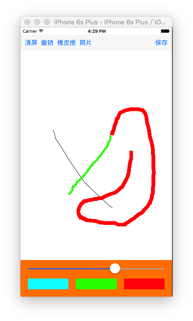

# gestureLock and drawingBoard

## gestureLock（手势锁）实现步骤
详见“IOSday - 常用封装软件 - gestureLock”
1. 布局控件：背景控件和手势锁控件
2. 手势锁控件：
    - 子控件：循环增加9个按钮，设置属性（注意是选中状态不是高亮状态），根据九宫格布局位置
    - 选中实现：按钮的选中通过哪种方法都会有高亮状态的延迟，所以我们不让按钮与用户交互，而是通过触摸事件（touchesBegan和touchesMove），pointInside WithEvent 逐次判断点是否落在按钮上，若是，则选中并加入选中按钮数组，否则不选中。另外已经选中的不重复选中
    - 将按钮中心点连线：在drawRect中将按钮用线段连接起来
    - 将按钮与当前点连线：在touchesMove方法中，记录当前点的位置，要求重绘，在drawRect中，从最后一个点画出一条线到当前点
    - 保存密码及清空图案：松开手时，由于要记录密码，所以应该在创建按钮时绑定tag值，最后遍历数组，拼接字符串将密码保存下来；取消按钮选中，将选中按钮数组清空，重绘。

## drawingBoard（涂鸦画板）实现步骤

1. 布局控件（做好屏幕适配）：上面的工具栏（通过toolBar布局)，下面的绘图工具栏(IOS9之后可以用Stack View布局，IOS9之前就拖3个按钮，做好屏幕适配)，中间的画板（继承UIView）

- 画板画线功能：
    1. 通过手势来监听移动，`开始监听时创建path，设置线宽，并加入到paths（因为要画多个图形）`
    - 手势改变时，画线，由于是要将多个点连接起来，所以要记录下`当前的path，不断的在self.path中画线`，重绘
    - 拼接路径可以不在drawRect中，但渲染必须在，因为要显示在layer上下文中
    - drawRect中，要将paths中的path逐一画出来

- 绘图工具栏：监听滑条栏和按钮，根据view.h提供的线宽和颜色，设置线宽和颜色。
    - 这里要注意，如果重绘时要将所有颜色画出来，必须写path的分类，增加颜色属性；在drawRect方法中，调用【path.color set】,将线段画出来；线宽不用的原因是，系统提供的path属性自带线宽

- 在vc.m中，拖线监听功能实现。为了封装性，里面的实现的功能应该调用view.h提供的方法
    - 清除功能：将paths数组清空，重绘
    - 撤销功能：将最后一个path从数组中移除，重绘
    - 橡皮擦功能：设置path的颜色为白色
    - 保存功能：开启位图上下文，将layer图层通过renderInContext渲染到当前上下文中（即位图上下文）,从图层中获取图片，保存到系统相册中
    - 照片功能：到系统相册中选择图片，通过modal跳转，选择完后回到画板，显出选择的图片，需要进行处理（示例中缺少提示，应该增加蒙板提示）
    - 处理图片功能：从相册中返回的图片
    	- 传递给一个继承自UIView的处理图片类（里面有一个图片子控件，使得处理后的图片通过drawInRect方法绘制到画板时能跟处理时一样。若是直接用imageView处理，最后传回画板时，图片会被放大至全屏）
    	- 增加手势进行调整，最后长按时，图片实现闪烁（通过动画设置透明度），通过位图上下文取出图片，通过通知返回处理后的图片，画到画板上；将图片加到paths数组中，在drawRect中，由于图片不能通过描线画出，要用`[path isKindOfClass:[UIImage class]]`判断，如果是图片，就`[image drawInRect:rect]`画出图片

#####保存功能
```objc
 // 渲染图层
[_drawView.layer renderInContext:UIGraphicsGetCurrentContext()];

// 保存图片到系统相册里
    // image:保存的图片
    // completionTarget:保存完成的监听者
    // completionSelector:保存完成的时候调用监听者的方法，该方法不能随便调用
##核心代码
    UIImageWriteToSavedPhotosAlbum(image, self, @selector(image:didFinishSavingWithError:contextInfo:), nil);
##
}

// 保存图片完成的时候必须调用下面方法
- (void)image:(UIImage *)image didFinishSavingWithError:(NSError *)error contextInfo:(void *)contextInfo
{
    if (error) {
        [MBProgressHUD showError:@"保存失败"];

    }else{
        [MBProgressHUD showSuccess:@"保存成功"];
    }
}
```

#####照片功能
```objc
// 选择照片
- (IBAction)pickerPhoto:(id)sender {

    // 进入系统的相册UIImagePickerController
    // 创建一个照片选择控制器

    UIImagePickerController *imagePickerVc = [[UIImagePickerController alloc] init];

    // 设置数据源
    imagePickerVc.sourceType = UIImagePickerControllerSourceTypeSavedPhotosAlbum;

    // 设置代理
    imagePickerVc.delegate = self;

    // modal
    [self presentViewController:imagePickerVc animated:YES completion:nil];
}

#pragma mark - UIImagePickerControllerDelegate
// 用户选择照片的时候调用
- (void)imagePickerController:(UIImagePickerController *)picker didFinishPickingMediaWithInfo:(NSDictionary *)info
{
    // 获取用户选择照片
    UIImage *image = info[UIImagePickerControllerOriginalImage];

    [self dismissViewControllerAnimated:YES completion:nil];

    // 处理下图片
    // 创建处理图片的view
    HandleImageView *hanldImageV = [[HandleImageView alloc] initWithFrame:_drawView.frame];
    [self.view addSubview:hanldImageV];

    // 给处理图片的view传递图片
    hanldImageV.image = image;
}
```
