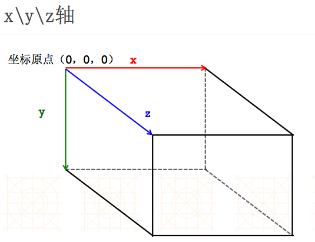

#QuartzCore(核心框架）

##QuartzCore坐标系

    怎么旋转图层：给三维坐标系的点，与原点形成向量，绕着向量旋转，加动画演示旋转效果
    怎么利用KVC改变形变
        KVC注意点：
         1> 给对象的哪个属性赋值，就写到keyPath里面。
         2> value的值一定是属性的类型才行
    如何快速二维旋转：ketPath为transform.rotation
    缩放注意：z轴不需要缩放，为1就好。
    KVC的好处：利用KVC可以快速的进行二维旋转和，宽,高同时缩放.
    *讲解顺序 阴影 -> 圆角半径 -> 边框 -> -> UIImageView圆角半径 ->transform -> KVC

5> 时钟-自定义图层
程序思路：
* 了解时钟由什么组成的，使用哪些控件。(UIImgeView,CALayer)
* 为什么不使用UIView，而使用CALayer,需要监听事件吗？
* 现实生活中秒针是怎么旋转的，绕着时钟的中点转，PPT演示，拖一根秒针线条
* 在ios中默认是绕着中心点旋转的，因为锚点默认在图层的中点，要想绕着下边中心点转，需要改变图层锚点的位置。
* 根据锚点，设置position坐标，为时钟的中点。
* 思考秒针旋转的角度，怎么知道当前秒针旋转到哪，当前秒针旋转的角度 = 当前秒数 * 每秒转多少°。
1> 计算一秒转多少° 360 * 60 = 6
2> 获取当前秒数，通过日历对象，获取日期组成成分 NSCalendar -> NSDateComponents -> 获取当前秒数
* 每隔一秒，获取最新秒数，更新时钟。
* 分钟一样的做法
* 时钟也一样
    1.每一分钟，时钟也需要旋转，60分钟 -> 1小时 - > 30°  ==》 每分钟 30 / 60.0  一分钟时针转0.5°
* 把时针和秒针头尾变尖，设置圆角半径

6> 核心动画01-CABasicAnimation
*    PPT简介
    *   Core Animation是直接作用在CALayer上的，并非UIView。
    *   Core Animation结构
    *   Core Animation 使用步骤
*   代码演示
    * 创建CALayer
    * touchBegin,点击屏幕，做动画
    * 创建动画，添加动画到CALayer
    * 怎样执行动画？执行动画的本质是改变图层的属性。
    * 告诉动画执行怎样的动画?设置动画属性(position)
    * 告诉动画属性怎么改变?设置动画属性值改变 toValue fromValue
    * duration:动画时长
    * 动画有反弹?取消反弹
        1> 执行动画完毕不要移除
        2> 设置动画填充模式，保持最新的位置。
    * rotation:
    三维旋转：transform
    二维旋转：transform.rotation
    * scale
    * 设置图层内容（心）
    * tovalue:@0.5
    * 总结CABasicAnimation只能在两个值之间做动画，怎么多个值做动画，用CAKeyframeAnimation

7> CAKeyframeAnimation
   * 面向view开发，拖一个view
   * values:能多个值之间做动画，按照顺序做。
   * path
   * 动画节奏(timingFunction)
   * 代理

8> * 图标抖动
   * PPT分析,左边旋转右边旋转 -> keyPath(transform.rotation) -> values -> 有点瘸 -> PPT分析 -> values添加一个值

9> * CATransition
    过度动画又叫转场动画 -> type(转场类型) -> subtype(方向) -> 动画进度
    注意:转场动画必须和过度代码放在一块，否则没有效果

10> * CAAnimationGroup
      同时进行多种动画 -> 平移，旋转，缩放 -> 取消反弹

11> * UIView封装的动画
    * 什么时候用核心动画，什么时候用UIView动画
    * 核心动画的缺点：都是假象，不能真正改变图层属性的值
    * 展示和真实的位置不同
    * 如果改变位置就用UIView的动画
    * 转场动画就用核心动画
    * 为什么转场用核心动画？因为UIView的转场动画太少。
    * 演示UIView的转场动画
    * touchBegin,切换图片

12> 转盘
    * 看素材分析控件(2个UIImgeView,1个按钮)
    * 自定义HMWheelView(处理转盘功能，以后其他项目直接拷贝就好了)
    * xib描述(界面固定，按钮有两种状态的图片)
    * 添加按钮，父控件是中间的那个UIImgeView,只有他需要旋转。
    * 在awakeFormNib添加，initWithCoder还没连线。
    * 按钮的位置：PPT分析，所有按钮的frame都一样，但是根据不同的角标，旋转不同的角度，相对上一个都旋转30°。
        1> 设置锚点：旋转是绕着锚点旋转的
        2> 设置position
        3> 设置尺寸
        4> 形变，旋转按钮
    * 按钮选中的背景
    * 监听按钮点击,允许父控件交互。
    * 裁剪大图片
    * CGImageCreateWithImageInRect(CGImageRef image, CGRect rect)
    * image:裁剪的图片 rect:裁剪的尺寸
    * CGImageRef 是 像素，而我们传的是点坐标，转换坐标系
    * 旋转转盘:不能用核心动画
    * 搞个定时器，每隔一段时间旋转一点角度，一秒旋转45°，每次旋转45/60，因为一秒调用60次，那个方法
    * 给外界提供开始旋转和停止旋转两个方法
    * 监听开始旋转按钮
        1> 不需要和用户交互，用核心动画
        2> 快速旋转的时候，暂停定时器，不需要同时旋转，会有问题
    * 旋转完之后，需要处理的业务逻辑
        1> 允许用户交互
        2> 选中按钮回到最上面中间位置，只要旋转按钮才知道自己旋转了多少，反向旋转这么多角度就好了，用make，把之前的旋转全部清空。
        3> 2秒后自动旋转

