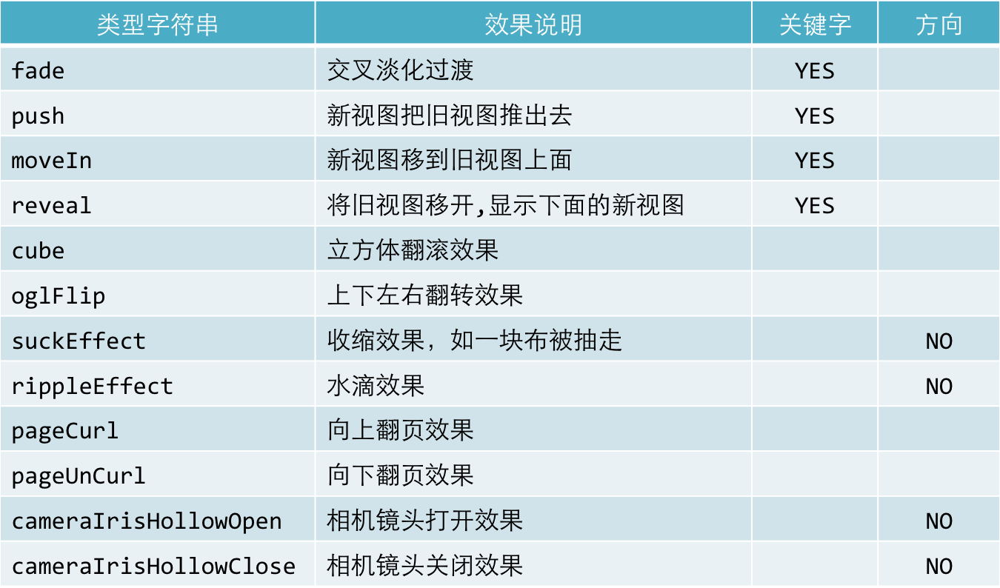

# CATransition
- 父类是CAAnimation

###转场动画——CATransition
- CATransition是CAAnimation的子类，用于做转场动画，能够为层提供移出屏幕和移入屏幕的动画效果。iOS比Mac OS X的转场动画效果少一点
- UINavigationController就是通过CATransition实现了将控制器的视图推入屏幕的动画效果
- 动画属性:
    - type：动画过渡类型
    - subtype：动画过渡方向
    - startProgress：动画起点(在整体动画的百分比)
    - endProgress：动画终点(在整体动画的百分比)

- 转场动画过渡效果图



### 界面切换的代码
```objc
    static int i = 2;
    NSString *imageName = [NSString stringWithFormat:@"%d",i];
    _imageView.image = [UIImage imageNamed:imageName];

    i++;
    if (i > 3) {
        i = 1;
    }

    // 只要切换界面 都可以使用转场动画
    // 谁切换界面 就添加到谁上
    // 转场动画代码必须和界面切换的代码放在一起

    // 转场动画
    CATransition *anim = [CATransition animation];

    // 指定转场类型
    anim.type = @"pageCurl";
    // 设置转场的方向
    anim.subtype = kCATransitionFromLeft;

    // 设置动画的进度
    anim.startProgress = 0.5;

    anim.endProgress = 0.8;

    anim.duration = 3;

    [_imageView.layer addAnimation:anim forKey:nil];
```
