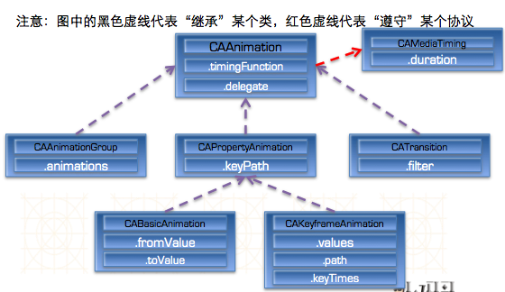

# Core Animation（核心动画）
- Core Animation，中文翻译为核心动画
- 是动画对象的父类，负责控制动画的持续时间和速度，是个抽象类，不能直接使用，要实现动画应该使用它具体的子类
- 是一组非常强大的动画处理API，利用它使用少量的代码能做出非常炫丽的动画效果
- Core Animation可以用在Mac OS X和iOS平台。
- Core Animation的动画执行过程都是在后台操作的，不会阻塞主线程。
- 注意：Core Animation是直接作用在CALayer上的，并非UIView


`(红色代表来自CAMediaTiming协议的属性)`


###Core Animation的使用步骤
- 如果不是xcode5之后的版本，使用它需要先添加QuartzCore.framework和引入对应的框架<QuartzCore/QuartzCore.h>
- 开发步骤:
    1. 首先得有CALayer
    2. 初始化一个CAAnimation对象，并设置一些动画相关属性
    3. 通过调用CALayer的addAnimation:forKey:方法，增加CAAnimation对象到CALayer中，这样就能开始执行动画了
    4. 通过调用CALayer的removeAnimationForKey:方法可以停止CALayer中的动画


### UIView和核心动画区别
1. 核心动画一切都是假象,并不会真实的修改layer的属性

- UIView真实改变属性才能有动画

- 什么时候使用核心动画,什么时候使用UIView

- 如果以后在执行动画的过程中,不需要与用户交互,用核心动画

- 核心动画使用场景: 转场动画用的最多

```objc
//分别用UIView和核心动画设置平移动画，打印最后的位置检验
- (void)animationDidStop:(CAAnimation *)anim finished:(BOOL)flag
{
    NSLog(@"%@", NSStringFromCGPoint(_redViwew.layer.position));
}
```

###使用UIView动画函数实现转场动画——单视图
```objc
+ (void)transitionWithView:(UIView *)view duration:(NSTimeInterval)duration options:(UIViewAnimationOptions)options animations:(void (^)(void))animations completion:(void (^)(BOOL finished))completion;

参数说明：
duration：动画的持续时间
view：需要进行转场动画的视图
options：转场动画的类型
animations：将改变视图属性的代码放在这个block中
completion：动画结束后，会自动调用这个block
```

###使用UIView动画函数实现转场动画——双视图
```objc
+ (void)transitionFromView:(UIView *)fromView toView:(UIView *)toView duration:(NSTimeInterval)duration options:(UIViewAnimationOptions)options completion:(void (^)(BOOL finished))completion;

参数说明：
duration：动画的持续时间
options：转场动画的类型
animations：将改变视图属性的代码放在这个block中
completion：动画结束后，会自动调用这个block
```

##CADisplayLink
- CADisplayLink是一种以屏幕刷新频率触发的时钟机制，每秒钟执行大约60次左右
- CADisplayLink是一个计时器，可以使绘图代码与视图的刷新频率保持同步，而NSTimer无法确保计时器实际被触发的准确时间
- 使用方法：
    - 定义CADisplayLink并制定触发调用方法
    - 将显示链接添加到主运行循环队列


