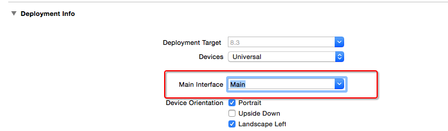

# IB
## 关于IBAction、IBOutlet的前缀
- 全称：`Interface Builder`
- 以前的UI界面开发模式：Xcode3 + Interface Builder
- 从Xcode4开始，Interface Builder已经整合到Xcode中了

##IBAction
- 只能修饰方法的返回值类型
- 被IBAction修饰的方法：
    - 能拖线到storyboard中
    - 返回值类型是void
    - 是对应的控制器的方法，不是被拖线的对象的方法，起监听拖线对象变化的作用
- 使用格式
```objc
-(IBAction)btnClick
{
    NSLog(@"按钮被点击了");
}```

##IBOutlet
- 被IBOutlet修饰的属性
    - 能拖线到storyboard中
    - 将被拖线对象作为控制器的成员变量
```objc
@property(nonatomic,weak)IBOutlet UILabel *laber;```

###使用IB（拖线）常见错误

- 第1个错误
    - 错误描述：
    - 出现下面错误的原因：90%的可能都是因为连线有问题，比如一些线已经“过期”或者IBOutlet属性代码被删掉了，但是属性连线还在
    - 解决：将残留的连线删掉
```objc
'NSUnknownKeyException', reason: '[<ViewController
0x7fdf7048b200> setValue:forUndefinedKey:]: this class
is not key value coding-compliant for the key```

- 第2个错误
    - 原因：调用了一个不存在的方法
    - 解决：检查方法名，使用正确并且存在的方法名
```objc
2016-02-28 15:04:54.938 buttonOperate[8700:513716] ***
Terminating app due to uncaught exception
'NSInvalidArgumentException', reason: '-[ViewController
transferWithFrame:]: unrecognized selector sent to
instance 0x7fe6c3d7b540'```

## storyboard
## storyboard文件的认识
- 作用：描述软件界面
- 程序启动的简单过程
    - 程序一启动，就会加载`Main.storyboard`文件
    - 会创建箭头所指的控制器，并且显示控制器所管理的软件界面
- 配置程序一启动就会加载的storyboard文件


## xib
###Xib和storyboard对比
- 共同点：
    - 都用来描述软件界面
    - 都用Interface Builder工具来编辑
    - 本质都是`转换成代码去创建控件`
        - 包括创建控件，加入视图中，设置frame等基本属性，拖线等功能

- 不同点
    - Xib是轻量级的，用来描述局部的UI界面
    - Storyboard是重量级的，用来描述整个软件的多个界面，并且能展示多个界面之间的跳转关系

###xib的加载
- `xib会转变成nib文件`
- loadNibNamed
```objc
NSArray *views = [[NSBundle mainBundle] loadNibNamed:@"xib文件名" owner:nil options:nil]```

- instantiateWithOwner
```objc
UINib *nib = [UINib nibWithNibName:@"xib文件名" bundle:nil];
NSArray *views = [nib instantiateWithOwner:nil options:nil];```

-  `[views firstObject]`,取出数组中的第一个元素，加载后的xib取出的是整个父控件。
-  `[views lastObject]`，取出数组中的最后一个元素，加载后的xib若只有一个父控件（子控件不算），也能取出父控件，否则不是取出父控件。


