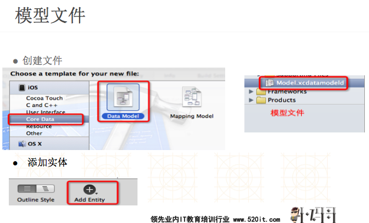
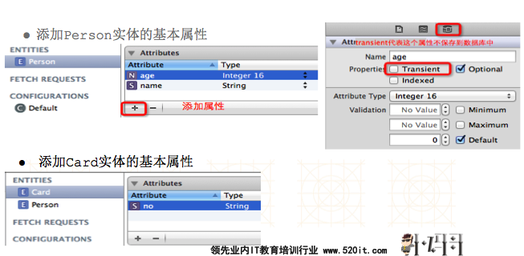
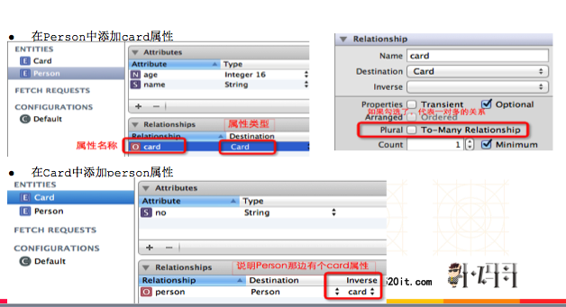
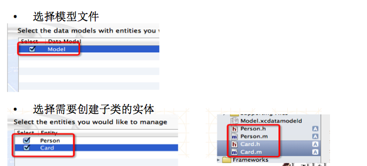
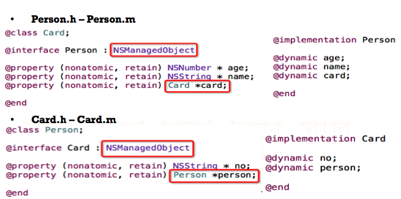

# IOS常用数据存储方式
1. XML属性列表（plist）归档
- Preference(偏好设置)
- NSKeyedArchiver归档(NSCoding)
- SQLite3
- Core Data

##应用沙盒
- 每个iOS应用都有自己的应用沙盒(应用沙盒就是文件系统目录)，与其他文件系统隔离。应用必须待在自己的沙盒里，其他应用不能访问该沙盒
- 模拟器应用沙盒的根路径在: (apple是用户名, 8.0是模拟器版本)
```objc
/Users/apple/Library/Application Support/iPhone Simulator/8.0/Applications
```

###应用沙盒结构
1. 应用程序包：即存放Documents，tmp等文件的文件夹，包含了所有的资源文件和可执行文件，包括Documents.Library.(caches、preference).tmp

- Documents：保存应用运行时生成的需要持久化的数据，iTunes同步设备时会备份该目录。例如，游戏应用可将游戏存档保存在该目录

- tmp：保存应用运行时所需的临时数据，使用完毕后再将相应的文件从该目录删除。应用没有运行时，系统也可能会清除该目录下的文件。iTunes同步设备时不会备份该目录

- Library/Caches：保存应用运行时生成的需要持久化的数据，iTunes同步设备时不会备份该目录。一般存储体积大、不需要备份的非重要数据

- Library/Preference：保存应用的所有偏好设置，iOS的Settings(设置)应用会在该目录中查找应用的设置信息。iTunes同步设备时会备份该目录

```objc
## Documents：(2种方式)
//利用沙盒根目录拼接”Documents”字符串
NSString *home = NSHomeDirectory();
NSString *documents = [home stringByAppendingPathComponent:@"Documents"];
// 不建议采用，因为新版本的操作系统可能会修改目录名

//利用NSSearchPathForDirectoriesInDomains函数
// directory:获取哪个文件夹
// domainMask:在哪个范围内搜索,NSUserDomainMask:表示在用户的手机的用户文件夹下查找
// expandTilde:是否展开全路径 YES:表示展开全路径 NO:不会展开全路径,会把应用沙盒的路径用波浪号(~)代替
// 在iOS中，只有一个目录跟传入的参数匹配，所以这个集合里面只有一个元素

NSString *documents =  [NSSearchPathForDirectoriesInDomains(NSDocumentDirectory, NSUserDomainMask, NO) objectAtIndex:0];

## tmp：NSString *tmp = NSTemporaryDirectory();

## Library/Caches：(跟Documents类似的2种方法)
利用沙盒根目录拼接”Caches”字符串
利用NSSearchPathForDirectoriesInDomains函数(将函数的第2个参数改为：NSCachesDirectory即可)

##Library/Preference：通过NSUserDefaults类存取该目录下的设置信息
```

##属性列表（plist）
- plist的文件名不能叫做“info”、“Info”之类的,这是因为与系统属性文件重名
- 属性列表是一种XML格式的文件，拓展名为plist
- 如果对象是NSString、NSDictionary、NSArray、NSData、NSNumber等类型，就可以使用writeToFile:atomically:方法直接将对象写到属性列表文件中
- Plist不能存储自定义对象
- 成功后会写入到Documents文件中

```objc
##加载plist
//xcode中plist创建步骤：NewFile -- IOS --Resource -- Property List
//获得Plist文件的全路径
NSString *path = [[NSBundle mainBundle] pathForResource:@"shops" ofType:@"plist"];
//加载plist文件
_shops = [NSArray arrayWithContentsOfFile:path];


##属性列表-归档NSDictionary
// 将数据封装成字典
NSMutableDictionary *dict = [NSMutableDictionary dictionary];
[dict setObject:@"15013141314" forKey:@"phone"];
// 将字典持久化到Documents/stu.plist文件中
[dict writeToFile:path atomically:YES];


属性列表-恢复NSDictionary
// 读取Documents/stu.plist的内容，实例化NSDictionary
NSDictionary *dict = [NSDictionary dictionaryWithContentsOfFile:path];
NSLog(@"phone:%@", [dict objectForKey:@"phone"]);
```

##偏好设置
- 很多iOS应用都支持偏好设置，比如保存用户名、密码、字体大小是否自动登录，等设置，iOS提供了一套标准的解决方案来为应用加入偏好设置功能
- 偏好设置好处:
    1. 不需要关心文件名
    - 快速进行键值对存储
    - 直接存储基本数据类型
- 成功后会写入到library(preference)中

```objc
##写入需保存的设置
[[NSUserDefaults standardUserDefaults] setFloat:18.0f forKey:@"text_size"];//注意类型匹配

##读取上次保存的设置
float textSize = [[NSUserDefaults standardUserDefaults] floatForKey:@"text_size"];

//注意：IOS7之前UserDefaults设置数据时，不是立即写入可能还没有写入磁盘应用程序就终止了导致数据丢失，可以通过调用synchornize方法强制写入；IOS7之后已经实现即时写入，可以省略此步
[defaults synchornize];
```

##NSKeyedArchiver
详见“NS0bject - NSCoder - NSKeyedArchiver”

##SQLite3
- SQLite3是一款开源的嵌入式关系型数据库，可移植性好、易使用、内存开销小
- SQLite3是无类型的，意味着你可以保存任何类型的数据到任意表的任意字段中。比如下列的创表语句是合法的：

```objc
   create table t_person(name, age);
   //为了保证可读性，建议还是把字段类型加上：
   create table t_person(name text, age integer);
```
- SQLite3常用的5种数据类型：text、integer、float、boolean、blob
- 在iOS中使用SQLite3，首先要添加库文件`libsqlite3.dylib`和导入主头文件

```objc
##创建、打开、关闭数据库
//创建或打开数据库
// path为：~/Documents/person.db
sqlite3 *db;
int result = sqlite3_open([path UTF8String], &db);

###代码解析：
sqlite3_open()将根据文件路径打开数据库，如果不存在，则会创建一个新的数据库。如果result等于常量SQLITE_OK，则表示成功打开数据库
sqlite3 *db：一个打开的数据库实例
数据库文件的路径必须以C字符串(而非NSString)传入


##执行不返回数据的SQL语句
//执行创表语句
char *errorMsg;  // 用来存储错误信息
char *sql = "create table if not exists t_person(id integer primary key autoincrement, name text, age integer);";
int result = sqlite3_exec(db, sql, NULL, NULL, &errorMsg);

###代码解析：
sqlite3_exec()可以执行任何SQL语句，比如创表、更新、插入和删除操作。但是一般不用它执行查询语句，因为它不会返回查询到的数据
sqlite3_exec()还可以执行的语句：
开启事务：begin transaction;
回滚事务：rollback;
提交事务：commit;


##带占位符插入数据
char *sql = "insert into t_person(name, age) values(?, ?);";
sqlite3_stmt *stmt;
if (sqlite3_prepare_v2(db, sql, -1, &stmt, NULL) == SQLITE_OK) {
    sqlite3_bind_text(stmt, 1, "母鸡", -1, NULL);
    sqlite3_bind_int(stmt, 2, 27);
}
if (sqlite3_step(stmt) != SQLITE_DONE) {
    NSLog(@"插入数据错误");
}
sqlite3_finalize(stmt);

###代码解析：
sqlite3_prepare_v2()返回值等于SQLITE_OK，说明SQL语句已经准备成功，没有语法问题

##带占位符插入数据
sqlite3_bind_text()：大部分绑定函数都只有3个参数
第1个参数是sqlite3_stmt *类型
第2个参数指占位符的位置，第一个占位符的位置是1，不是0
第3个参数指占位符要绑定的值
第4个参数指在第3个参数中所传递数据的长度，对于C字符串，可以传递-1代替字符串的长度
第5个参数是一个可选的函数回调，一般用于在语句执行后完成内存清理工作
sqlite_step()：执行SQL语句，返回SQLITE_DONE代表成功执行完毕
sqlite_finalize()：销毁sqlite3_stmt *对象

##查询数据
char *sql = "select id,name,age from t_person;";
sqlite3_stmt *stmt;
if (sqlite3_prepare_v2(db, sql, -1, &stmt, NULL) == SQLITE_OK) {
    while (sqlite3_step(stmt) == SQLITE_ROW) {
        int _id = sqlite3_column_int(stmt, 0);
        char *_name = (char *)sqlite3_column_text(stmt, 1);
        NSString *name = [NSString stringWithUTF8String:_name];
        int _age = sqlite3_column_int(stmt, 2);
        NSLog(@"id=%i, name=%@, age=%i", _id, name, _age);
    }
}
sqlite3_finalize(stmt);

##代码解析
sqlite3_step()返回SQLITE_ROW代表遍历到一条新记录
sqlite3_column_*()用于获取每个字段对应的值，第2个参数是字段的索引，从0开始
```


##core data
- Core Data框架提供了对象-关系映射(ORM)的功能，即能够将OC对象转化成数据，保存在SQLite3数据库文件中，也能够将保存在数据库中的数据还原成OC对象。在此数据操作期间，不需要编写任何SQL语句。
- 使用此功能，要添加CoreData.framework和导入主头文件<CoreData/CoreData.h>
- 在Core Data，需要进行映射的对象称为实体(entity)，而且需要使用Core Data的模型文件来描述应用的所有实体和实体属性
这里以Person和Card(身份证)2个实体为例子，先看看实体属性和之间的关联关系




```objc
Person:name;age;card
Card:no;person

Person中有个Card属性，Card中有个Person属性
属于一对一双向关联
```

##core data 主要对象

```objc
NSManagedObjectContext
用途：负责应用和数据库之间的交互(CRUD)
.persistentStoreCoordinator

NSPersistentStoreCoordinator
用途:添加持久化存储库(比如SQLite数据库)
.managedObjectModel

NSManagedObjectModel
用途：代表Core Data的模型文件
.entities

NSEntityDescription
用途：用来描述实体
.name = @”Card”

NSEntityDescription
用途：用来描述实体
.name = @”Person”
```


## 搭建Core Data上下文环境

```objc
//从应用程序包中加载模型文件
NSManagedObjectModel *model = [NSManagedObjectModel mergedModelFromBundles:nil];
传入模型，初始化NSPersistentStoreCoordinator
NSPersistentStoreCoordinator *psc = [[[NSPersistentStoreCoordinator alloc] initWithManagedObjectModel:model] autorelease];
构建SQLite文件路径
NSString *docs = [NSSearchPathForDirectoriesInDomains(NSDocumentDirectory, NSUserDomainMask, YES) lastObject];
NSURL *url = [NSURL fileURLWithPath:[docs stringByAppendingPathComponent:@"person.data"]];

###添加持久化存储库，这里使用SQLite作为存储库
NSError *error = nil;
NSPersistentStore *store = [psc addPersistentStoreWithType:NSSQLiteStoreType configuration:nil URL:url options:nil error:&error];
if (store == nil) { // 直接抛异常
    [NSException raise:@"添加数据库错误" format:@"%@", [error localizedDescription]];
}
初始化上下文，设置persistentStoreCoordinator属性
NSManagedObjectContext *context = [[NSManagedObjectContext alloc] init];
context.persistentStoreCoordinator = psc;
// 用完之后，还是要[context release];

###添加数据
传入上下文，创建一个Person实体对象
NSManagedObject *person = [NSEntityDescription insertNewObjectForEntityForName:@"Person" inManagedObjectContext:context];
设置简单属性
[person setValue:@"MJ" forKey:@"name"];
[person setValue:[NSNumber numberWithInt:27] forKey:@"age"];
传入上下文，创建一个Card实体对象
NSManagedObject *card = [NSEntityDescription insertNewObjectForEntityForName:@"Card" inManagedObjectContext:context];
[card setValue:@"4414241933432" forKey:@"no"];
设置Person和Card之间的关联关系
[person setValue:card forKey:@"card"];

利用上下文对象，将数据同步到持久化存储库
NSError *error = nil;
BOOL success = [context save:&error];
if (!success) {
    [NSException raise:@"访问数据库错误" format:@"%@", [error localizedDescription]];
}
// 如果是想做更新操作：只要在更改了实体对象的属性后调用[context save:&error]，就能将更改的数据同步到数据库

###查询数据
初始化一个查询请求
NSFetchRequest *request = [[[NSFetchRequest alloc] init] autorelease];
设置要查询的实体
NSEntityDescription *desc = [NSEntityDescription entityForName:@"Person" inManagedObjectContext:context];
设置排序（按照age降序）
NSSortDescriptor *sort = [NSSortDescriptor sortDescriptorWithKey:@"age" ascending:NO];
request.sortDescriptors = [NSArray arrayWithObject:sort];
设置条件过滤(name like '%Itcast-1%')
NSPredicate *predicate = [NSPredicate predicateWithFormat:@"name like %@", @"*Itcast-1*"];
request.predicate = predicate;


###执行请求
NSError *error = nil;
NSArray *objs = [context executeFetchRequest:request error:&error];
if (error) {
    [NSException raise:@"查询错误" format:@"%@", [error localizedDescription]];
}
###遍历数据
for (NSManagedObject *obj in objs) {
    NSLog(@"name=%@", [obj valueForKey:@"name"]
}


###删除数据
传入需要删除的实体对象
[context deleteObject:managedObject];
将结果同步到数据库
NSError *error = nil;
[context save:&error];
if (error) {
    [NSException raise:@"删除错误" format:@"%@", [error localizedDescription]];
}


###打开Core Data的SQL日志输出开关，步骤：
1.打开Product，点击Edit Scheme...
2.点击Arguments，在Arguments Passed On Launch中添加2项
- -com.apple.CoreData.SQLDebug
- 1

###Core Data的延迟加载
Core Data不会根据实体中的关联关系立即获取相应的关联对象
比如通过Core Data取出Person实体时，并不会立即查询相关联的Card实体；当应用真的需要使用Card时，才会查询数据库，加载Card实体的信息

###创建NSManagedObject的子类
默认情况下，利用Core Data取出的实体都是NSManagedObject类型的，能够利用键-值对来存取数据
但是一般情况下，实体在存取数据的基础上，有时还需要添加一些业务方法来完成一些其他任务，那么就必须创建NSManagedObject的子类
```

###创建NSManagedObject的子类



//那么生成一个Person实体对象就应该这样写
```objc
Person *person = [NSEntityDescription insertNewObjectForEntityForName:@"Person" inManagedObjectContext:context];
person.name = @"MJ";
person.age = [NSNumber numberWithInt:27];

Card *card = [NSEntityDescription insertNewObjectForEntityForName:@”Card" inManagedObjectContext:context];
card.no = @”4414245465656";
person.card = card;
```
