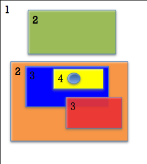
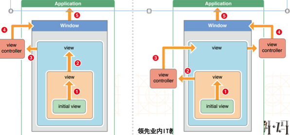
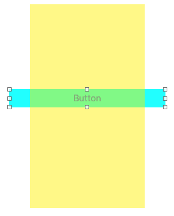
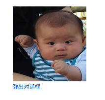

# IOSEvents
- 在用户使用app过程中，会产生各种各样的事件,可以分为3大类型
    - 触摸事件
    - 加速计事件
    - 远程控制事件

###响应者对象
- 在iOS中不是任何对象都能处理事件，只有继承了UIResponder的对象才能接收并处理事件。我们称之为“响应者对象”，即能处理事件的对象
- UIApplication、UIViewController、UIView都继承自UIResponder，因此它们都是响应者对象，都能够接收并处理事件

###UIResponder
详见"NSObject - UIResponder"

###UIView的触摸事件处理
- 即`touchesXXX withEvent:`系列方法使用，详见"NSObject - UIResponder".

###UIView的加速计事件处理
- 即`motionXXX withEvent:`系列方法使用，详见"NSObject - UIResponder".

###UIView的远程控制事件处理
- 即`remoteControlReceivedWithEvent:`系列方法使用，详见"NSObject - UIResponder".

###UITouch
详见“NSObject - UITouch”

###UIEvent
详见“NSObject - UIEvent”


## 事件处理的完整过程
#### 事件的产生和传递
1. 发生触摸事件后，系统会将该事件加入到一个由UIApplication管理的事件队列中，是队列不是栈，事件是先进先处理

- UIApplication会从事件队列中取出最前面的事件，并将事件分发下去以便处理，通常，先发送事件给应用程序的主窗口（keyWindow）,它是第一个接收事件的控件

- 主窗口会在视图层次结构中找到一个最合适的视图来处理触摸事件，这也是整个事件处理过程的第一步

##### 触摸事件的传递是从父控件传递到子控件


- 点击了绿色的view：
    - UIApplication -> UIWindow -> 白色 -> 绿色
- 点击了蓝色的view：
    - UIApplication -> UIWindow -> 白色 -> 橙色 -> 蓝色
- 点击了黄色的view：
    - UIApplication -> UIWindow -> 白色 -> 橙色 -> 蓝色 -> 黄色

`如果父控件不能接收触摸事件，那么子控件就不可能接收到触摸事件(掌握)`
`事件传递不同于响应者链条，viewController不是传递者之一（不是控件，无法接收触摸事件），它并没有"hitText withEvent"方法`

##### 最合适处理事件的控件的选择流程：
1. 自己是否能接收触摸事件？(`hitText withEvent`判断)
- 触摸点是否在自己身上？(`pointInside: withEvent`判断)
- 从后往前遍历子控件，重复前面的两个步骤
- 如果没有符合条件的子控件，那么就自己最适合处理

- 找到合适的视图控件后，就会调用视图控件的触摸事件方法来作具体的事件处理（即`touchesXXX withEvent:`系列方法，也称之为“响应”），详见下面“响应者链的事件传递过程”

###响应者链的事件传递过程
1. 从最合适的控件开始寻找响应者（实现触摸事件方法`touchesXXX系列方法`的对象），如果该控件不是响应者，则不断往上传递，直至找到响应者

    - 判断touchesBegan是否实现，若实现，则返回响应者
    - 如果没有实现或者主动调用[super touches….]方法，都会将事件顺着响应者链条往上传递，传递给上一个响应者
        - touchesBegan的默认做法（即不实现该方法）相当于主动调用了[super touches….]
    - 调用上一个响应者的touches….方法，重复上面判断

    `小技巧：若想要父子控件都处理事件，则先让子控件实现触摸事件方法，再调用[super touches….]传递给父控件处理`

- 传递过程中，如果view是控制器的view，就传递给控制器；如果不是控制器的view，则将其传递给它的父视图，直至到最顶级视图

- 在视图层次结构的最顶级视图，如果也不能处理收到的事件或消息，则其将事件或消息传递给window对象

- 如果window对象也不处理，则其将事件或消息传递给UIApplication对象

- 如果UIApplication也不能处理该事件或消息，则将其丢弃



### UIView不接收触摸事件的三种情况
1. 不接收用户交互
`view.userInteractionEnabled = NO`

- 隐藏
`view.hidden = YES`

- 透明
`view.alpha = 0.0 ~ 0.01`

- 提示：UIImageView的userInteractionEnabled默认就是NO，因此UIImageView以及它的子控件默认是不能接收触摸事件的

- 小技巧：如果不想让子控件处理事件，可以设置不能触摸，而让父控件响应事件，而不必通过hitTest方法处理


### 最优处理控件接收触摸事件与触摸点判断方法
- 接收触摸事件判断（底层实现）

```objc
// 什么时候调用:当一个事件传递给一个控件的时候调用(最早从keyWindow调用）
// 作用：寻找最合适view
// point:也是方法调用者坐标系上的点
- (UIView *)hitTest:(CGPoint)point withEvent:(UIEvent *)event
{
    // 1.判断下自己能否接收触摸事件
    if (self.userInteractionEnabled == NO || self.hidden == YES || self.alpha <= 0.01) return nil;

    // 2.判断下点在不在当前控件上
    // 用pointInside方法判断点在不在控件上,point这个必须是方法调用者坐标系上的点
    if ([self pointInside:point withEvent:event] == NO) return nil;

    // 3.从后往前遍历自己的子控件
    int count = (int)self.subviews.count;
    for (int i = count - 1; i >= 0; i--) {

        // 把自己坐标系上点转化成子控件坐标系上点
        CGPoint childP = [self convertPoint:point toView:self.subviews[i]];
        //4. 遍历子控件，判断是否能接收触摸事件和点是否在其身上
        UIView *fitView = [self.subviews[i] hitTest:childP withEvent:event];

        //5. 如果找到最合适view就直接返回
        if (fitView) return fitView;
    }
    // 5.自己就是最合适view
    return self;
}
```

- 触摸点判断（底层实现）

```objc
// 作用:判断point在不在方法调用者上
// point:必须是方法调用者坐标系上的点（需要通过“convertPoint toView方法转换”
// 什么时候调用:hitTest方法底层就会调用这个方法,判断点在不在控件
- (BOOL)pointInside:(CGPoint)point withEvent:(UIEvent *)event
```
- 小技巧：如果想让控件某部分响应事件，另一部分交由另一个控件处理：
    - 示例： 在黄色控件下面有一个蓝色的按钮（按钮面积小于黄色控件），两个有一个相同的父控件，当点落在蓝色与黄色控件交互的地方，由蓝色按钮处理，否则由黄色控件处理


```objc
- (UIView *)hitTest:(CGPoint)point withEvent:(UIEvent *)event{

    // 当前点转化成按钮上的点
    CGPoint btnP = [self convertPoint:point toView:self.btn];

    // 判断下点在不在按钮上
    if ([self.btn pointInside:btnP withEvent:event]) {
        return self.btn;
    }else{
        return [super hitTest:point withEvent:event];
    }
}
```

### 接收触摸事件与触摸点判断综合示例
- 实现一个可以拖动的按钮，点击按钮时，会弹出一个对话框，对话框分为一般状态和高亮状态，分别是两张图片。




- 实现步骤
    1. 在storyboard拖一个按钮
    - 新建一个继承自UIButton的按钮，起名为FZQButton
    - 修改storyboard中的按钮类为FZQButton
    - 在FZQButton.m中通过touchMove方法实现按钮拖动(详见下面代码）
    - FZQButton.h增加chatView属性
    - 在vc.m中通过过拖线监听按钮的点击
    - 按钮点击时创建一个对话框，并将其加入到按钮的子控件中，并成为按钮的成员变量（实现点击高亮）(详见下面代码）
    - 在FZQButton.m中通过hitText方法，实现当点落在chatView上，由chatView响应（具体可参考`触摸点小技巧示例`）

```objc
#####在FZQButton.m中通过touchMove方法实现按钮拖动(详见下面代码）
- (void)touchesMoved:(NSSet *)touches withEvent:(UIEvent *)event
{
    // 获取UITouch对象
    UITouch *touch = [touches anyObject];

    // 获取当前点
    CGPoint curP = [touch locationInView:self];

    // 获取上一个点
    CGPoint preP = [touch previousLocationInView:self];

    // 获取当前手指偏移量
    CGFloat offsetX = curP.x - preP.x;
    CGFloat offsetY = curP.y - preP.y;

    // 移动按钮
    self.transform = CGAffineTransformTranslate(self.transform, offsetX, offsetY);
}

#####vc.m中按钮点击时创建一个对话框，并将其加入到按钮的子控件中，并成为按钮的成员变量（实现点击高亮）(详见下面代码）
// 弹出对话框
- (IBAction)btnClick:(PopButton *)sender {
    // 创建对话框按钮
    UIButton *chatView = [UIButton buttonWithType:UIButtonTypeCustom];
    [chatView setBackgroundImage:[UIImage imageNamed:@"对话框"] forState:UIControlStateNormal];//设置常规状态图片
    [chatView setBackgroundImage:[UIImage imageNamed:@"小孩"] forState:UIControlStateHighlighted];//设置高亮状态图片

##  核心代码
    /** 设置尺寸，位置 */
    [chatView sizeToFit];//自动根据View设置合适大小
    chatView.center = CGPointMake(chatView.bounds.size.width * 0.5, -chatView.bounds.size.height * 0.5);
##
    /** 加入父控件--按钮 */
    sender.chatView = chatView;
    [sender addSubview:chatView];
}

```
