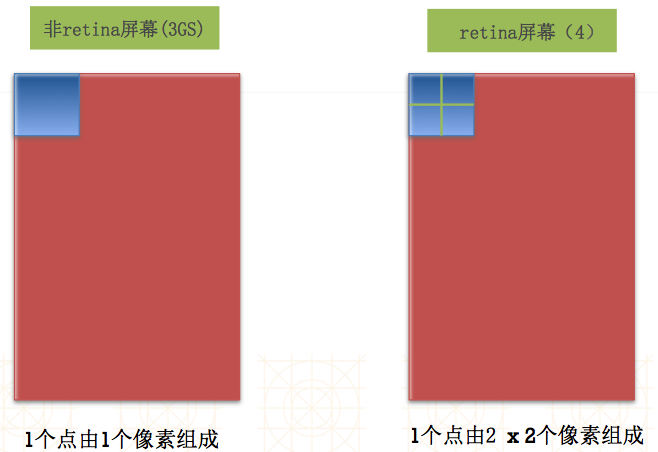
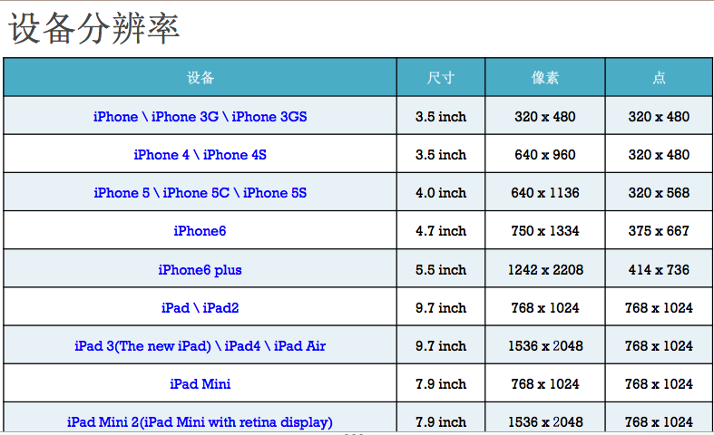

#适配
- 适应、兼容各种不同的情况
- 移动开发中适配的常见种类
    - 系统适配
        - 针对不同版本的操作系统进行适配
    - 屏幕适配
        - 针对不同大小的屏幕尺寸进行适配
        - iPhone的尺寸
            - 3.5inch   IPhone4及4s及之前版本
            - 4.0inch   IPhone5及5s
            - 4.7inch   IPhone6及6s
            - 5.5inch   IPhone6Plus
        - iPad的尺寸
            - 7.9inch   IPadMini
            - 9.7inch   IPad
        - 屏幕方向
            - 竖屏
            - 横屏

##点和像素
- 在用户眼中
    - 屏幕是由无数个像素组成的
    - 像素越多，屏幕越清晰

- 在开发者眼中
    - 屏幕是由无数个点组成的，点又是由像素组成的
    - 像素越多，屏幕越清晰



##Autoresizing
- iPad出现以后
- 需要横竖屏适配
- 出现了一种方便的屏幕适配技术：Autoresizing
    - 局限性：仅仅能解决子控件和父控件之间的相对关系问题
- UIViewAutoresizingFlexible`Left`Margin   = 1 << 0,
    - 距离父控件`左边`的间距是伸缩的
- UIViewAutoresizingFlexible`Right`Margin  = 1 << 2,
    - 距离父控件`右边`的间距是伸缩的
- UIViewAutoresizingFlexible`Top`Margin    = 1 << 3,
    - 距离父控件`上边`的间距是伸缩的
- UIViewAutoresizingFlexible`Bottom`Margin = 1 << 5
    - 距离父控件`下边`的间距是伸缩的
- UIViewAutoresizingFlexible`Width`        = 1 << 1,
    - `宽度`跟随父控件`宽度`进行伸缩
- UIViewAutoresizingFlexible`Height`       = 1 << 4,
    - `高度`跟随父控件`高度`进行伸缩

```objc
UIView *redView = [[UIView alloc] init];
    redView.backgroundColor = [UIColor redColor];
    redView.frame = CGRectMake(20, 20, 200, 250);
    [self.view addSubview:redView];
    self.redView = redView;

    UIView *blueView = [[UIView alloc] init];
    // 永远粘着父控件的右下角
    blueView.autoresizingMask = UIViewAutoresizingFlexibleLeftMargin | UIViewAutoresizingFlexibleTopMargin | UIViewAutoresizingFlexibleWidth;
    blueView.backgroundColor = [UIColor blueColor];
    CGFloat blueWH = 50;
    CGFloat blueX = 200 - blueWH;
    CGFloat blueY = 250 - blueWH;
    blueView.frame = CGRectMake(blueX, blueY, blueWH, blueWH);
    [redView addSubview:blueView];
```

##Autolayout
- Autolayout是一种“自动布局”技术，专门用来布局UI界面的- Autolayout自iOS6开始引入，由于Xcode4的不给力，当时并没有得到很大推广自iOS7（Xcode5）开始，Autolayout的开发效率得到很大的提升
- 核心概念
    - 参照
        - 所添加的约束跟哪个控件有关（相对于哪个控件来说）
    - 约束
        - 尺寸约束
            - width约束
            - height约束
        - 位置约束
            - 间距约束（上下左右间距）
- 常见单词
    - Leading -> Left -> 左边
    - Trailing -> Right -> 右边

## iOS8开始（Xcode6开始）
- 出现了一种新的屏幕适配技术：Sizeclass

### NSLayoutConstraint
- 父类是NSObject
- 拥抱AutoLayout,远离frame（不要共用）
- 代码实现步骤(
```objc
//1、添加约束之前，一定要保证相关控件都已经在各自的父控
UIView *blueView = [[UIView alloc] init];
blueView.backgroundColor = [UIColor blueColor];
[self.view addSubview:blueView];
//2、先禁止autoresizing功能
view.translatesAutoresizingMaskIntoConstraints = NO;
//3、利用NSLayoutConstraint类创建具体的约束对象(利用万能公式设置）
/**
     *  view1 ：要约束的控件
     *  attr1 ：约束的类型（做怎样的约束）
     *  relation ：与参照控件之间的关系
     *  view2 ：参照的控件
     *  attr2 ：约束的类型（做怎样的约束）
     *  multiplier ：乘数
     *  constant ：常量
     */
NSLayoutConstraint *blueViewLCTop = [NSLayoutConstraint constraintWithItem:blueView（view1） attribute:NSLayoutAttributeTop（attr1） relatedBy:NSLayoutRelationEqual（relation） toItem:self.view（view2） attribute:NSLayoutAttributeTop（multiplier） multiplier:1.0 constant（constant）:0];
//4、添加约束对象到相应的view上
//遵从：自身约束添加到自己身上；自身与父控件共同约束添加到父控件身上；自身与其他控件共同约束添加到能同时管理两个控件的View身上
-(void)addConstraint:(NSLayoutConstraint *)constraint;
-(void)addConstraints:(NSArray *)constraints;
//5.重复3-4，将所有约束补齐
```


###VFL
- VFL全称是Visual Format Language，翻译过来是“可视化格式语言”
- VFL是苹果公司为了简化Autolayout的编码而推出的抽象语言
- 不支持[blueView(==redView*2)]（乘法）的写法
- 代码实现步骤
    ```objc
//1、添加约束之前，一定要保证相关控件都已经在各自的父控
UIView *blueView = [[UIView alloc] init];
blueView.backgroundColor = [UIColor blueColor];
[self.view addSubview:blueView];
//2、先禁止autoresizing功能
view.translatesAutoresizingMaskIntoConstraints = NO;
//3、利用VFL
    //会将redView包装成@"redView"
    NSString *vflH = @"H:[redView(100)]-margin-|";
    //距离的字典，用来代表VFL中margin（距离），可以直接写@20
    NSDictionary *metrics =@{@"margin":@20};
    //对象的字典,前面是名字，后面的UI控件
    NSDictionary *views =  @{@"redView":redView};
//    NSDictionary *views = NSDictionaryOfVariableBindings(blueView, redView);
    /**
     *  返回：通过VFL定义的约束
     *  format ：VFL语句
     *  opts ：约束类型
     *  metrics ：VFL语句中用到的具体数值
     *  views ：VFL语句中用到的控件
     *  NSDictionaryOfVariableBindings(...)：创建一个字典（内部包含VFL语句中用到的控件）的快捷宏定义
     */
    NSArray *redViewH = [NSLayoutConstraint constraintsWithVisualFormat:vflH options:kNilOptions  metrics:metrics views:views];
    [self.view addConstraints:redViewH];
//4、添加约束对象到相应的view上
    //遵从：自身约束添加到自己身上；自身与父控件共同约束添加到父控件身上；自身与其他控件共同约束添加到能同时管理两个控件的View身上
-(void)addConstraint:(NSLayoutConstraint *)constraint;
-(void)addConstraints:(NSArray *)constraints;
//5.重复3-4，将所有约束补齐```


##基于Autolayout的动画
```objc
[UIView animateWithDuration:1.0 animations:^{
    [添加了约束的view layoutIfNeeded];
}];```


## Masonry
- 目前最流行的Autolayout第三方框架
- 用优雅的代码方式编写Autolayout
- 省去了苹果官方恶心的Autolayout代码
- 大大提高了开发效率
- 使用注意
    - ##mas_equalTo和equalTo
        - mas_equalTo有自动包装功能，比如自动将20包装为@20;equalTo没有自动包装功能
        - 如果添加了下面的宏，那么mas_equalTo和equalTo就没有区别
```objc
#define MAS_SHORTHAND_GLOBALS//注意：这个宏一定要添加到#import "Masonry.h"前面```
    - ##mas_width和width
        - width是make对象的一个属性，用来添加宽度约束用的，表示对宽度进行约束
        - mas_width是一个属性值，用来当做equalTo的参数，表示某个控件的宽度属性
        - 如果添加了下面的宏，mas_width也可以写成width
```objc
#define MAS_SHORTHAND//mas_height、mas_centerX以此类推
```
- ##with和and可有可无

```objc
// 创建约束（只会添加新的约束）
    [blueView makeConstraints:^(MASConstraintMaker *make) {
        make.left.equalTo(self.view.left).offset(20);
        make.bottom.equalTo(self.view.bottom).with.offset(-20);
        make.right.equalTo(redView.left).with.offset(-20);
        make.height.equalTo(40);
        make.width.equalTo(redView.width);
    }];

    [redView makeConstraints:^(MASConstraintMaker *make) {
        make.right.equalTo(self.view.mas_right).offset(-20);
        make.top.equalTo(blueView.mas_top);
        make.bottom.equalTo(blueView.mas_bottom);
    }];

    // 更新约束
    [blueView updateConstraints:^(MASConstraintMaker *make) {
        make.height.equalTo(80);
    }];

    // 删除之前的约束，重新添加约束
    //    [blueView remakeConstraints:^(MASConstraintMaker *make) {
    //
    //    }];
```
