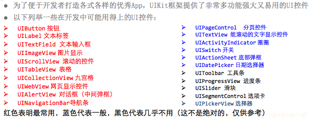
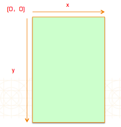

# UI
##可能用得上的UI控件：

##UIkit坐标系
- 在UIKit中，坐标系的原点(0，0)在左上角，x值向右正向延伸，y值向下正向延伸

// 自动提示宏:就是在输入宏的时候有提示功能
// 需求:想输入frame属性的时候有提示

// 自动提示宏,(objc.keyPath)这一部分内容,仅仅是让你的宏有提示功能

// 输入什么属性的参数,就生成对应属性的字符串
// keyPath转成成OC字符串

// 宏里面可以直接把宏的参数转成成c字符串

// 直接在宏的参数前添加#,就可以生成这个参数的c的字符串
#define keyPath(objc,keyPath) @(((void)objc.keyPath, #keyPath))

//#define keyPath(objc,keyPath) ((void)objc.keyPath, @(#keyPath))

// 宏实现:每次输入宏里面的参数的字母,就会拷贝一次
// 每次输入宏里面的参数的时候,会自动把当前参数前面的内容补齐

