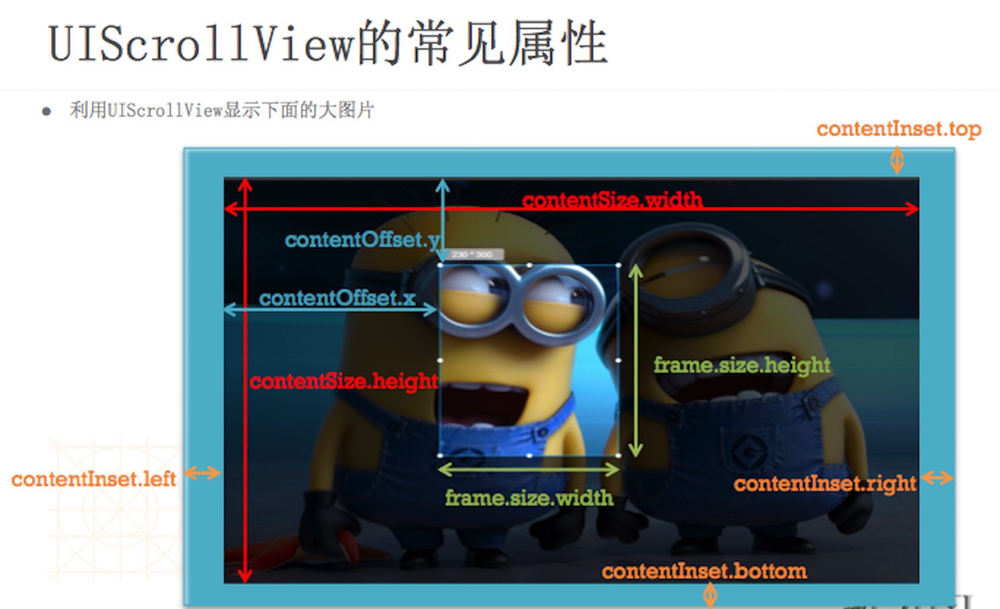

# UIScrollView
- 父类是UIView
- UIScrollView是一个能够滚动的视图控件，可以用来展示大量的内容，并且可以通过滚动查看所有的内容


##UIScrollView的基本使用
- UIScrollView的用法很简单
- 将需要展示的内容添加到UIScrollView中
- 设置UIScrollView的contentSize属性，告诉UIScrollView所有内容的尺寸，也就是告诉它滚动的范围
- 显示细节：
    - 超出UIScrollView边框的内容会被自动隐藏
    - 用户可以用过手势拖动来查看超出边框并被隐藏的内容

##UIScrollView无法滚动情况
- 没有设置`contentSize`
- `scrollEnabled = NO`
- 没有接收到触摸事件:`userInteractionEnabled = NO`（这时其内所有视图都不可与用户交互）
… …

##常见属性
1. contentOffset：表示UIScrollView滚动的位置
    - （其实就是内容左上角与scrollView左上角的间距值）
```objc
@property(nonatomic) CGPoint contentOffset;```

- contentSize：表示UIScrollView内容的尺寸，滚动范围
    - （其实就是内容左上角与scrollView左上角的间距值）
```objc
@property(nonatomic) CGSize contentSize;```

- contentInset：在UIScrollView的4周增加额外的滚动区域
    - 用来避免scrollView的内容被其他控件挡住
```objc
@property(nonatomic) UIEdgeInsets contentInset;```




###其他属性
1. bounces：设置UIScrollView是否需要弹簧效果（默认YES）
```objc
@property(nonatomic) BOOL bounces;```

1. bounces：设置水平方向是否需要弹簧效果（默认YES）
```objc
@property(nonatomic) BOOL bounces;```

1. alwaysBounceVertical：设置垂直方向是否需要弹簧效果（下拉刷新）（默认NO）
```objc
@property(nonatomic)         BOOL                         alwaysBounceVertical;```

- scrollEnabled：设置UIScrollView是否能滚动
```objc
@property(nonatomic,getter=isScrollEnabled) BOOL scrollEnabled;```

- showsHorizontalScrollIndicator：是否显示水平滚动条
```objc
@property(nonatomic) BOOL showsHorizontalScrollIndicator;```

- showsVerticalScrollIndicator：是否显示垂直滚动条
```objc
@property(nonatomic) BOOL showsVerticalScrollIndicator;```

- indicatorStyle：指示器风格
```objc
@property(nonatomic)         UIScrollViewIndicatorStyle   indicatorStyle;```

- pagingEnabled：是否分页
```objc
@property(nonatomic,getter=isPagingEnabled) BOOL          pagingEnabled；
```

##UIScrollView与控制器（代理）
1. 设置代理
```objc
self.scrollView.delegate = self;
```

- 让控制器遵守协议
```objc
@interface FZQpageView()<UIScrollViewDelegate>```

- 实现协议中的方法

```objc
// 用户开始拖拽时调用
-(void)scrollViewWillBeginDragging:(UIScrollview *)scrollView;

//滚动到某个位置时调用
-(void)scrollViewDidScroll:(UIScrollView *)scrollView;

// 用户结束拖拽时调用
-(void)scrollViewDidEndDragging:(UIScrollView *)scrollView willDecelerate:(BOOL)decelerate;

//屏幕停止滚动时调用
-(void)scrollViewDidEndDecelerating:(UIScrollView *)scrollView;
```

###UIScrollView的缩放原理（MAC中按住option缩放）
- 当用户在UIScrollView身上使用捏合手势时，UIScrollView会调用代理的viewForZoomingInScrollView:方法
- 缩放实现步骤：

    1. 设置UIScrollView的id<UISCrollViewDelegate> delegate代理对象
    - 设置minimumZoomScale ：缩小的最小比例
    - 设置maximumZoomScale ：放大的最大比例
    - 让代理对象实现下面的方法，返回需要缩放的视图控件

```objc
//返回需要缩放的视图控件
-(UIView *)viewForZoomingInScrollView:(UIScrollView *)scrollView;
```

- 跟缩放相关的其他代理方法
```objc
//缩放完毕的时候调用
-(void)scrollViewWillBeginZooming:(UIScrollView *)scrollView withView:(UIView *)view
```

```objc
//正在缩放的时候调用
-(void)scrollViewDidZoom:(UIScrollView *)scrollView
```


