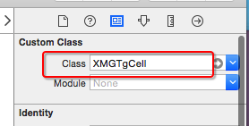
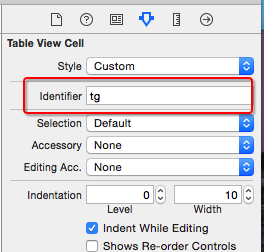

# UITableViewCell
- UITableView的每一行都是一个UITableViewCell，通过dataSource的tableView:cellForRowAtIndexPath:方法来初始化每一行
- 通过init方法创建，底层调用-(instancetype)initWithStyle:(UITableViewCellStyle)style reuseIdentifier:(NSString *)reuseIdentifier;通过storyboard和xib,底层调用-(instancetype)initWithCoder:(NSCoder *)aDecoder方法

###contentView
- 父类是UIView
- UITableViewCell内部有个默认的子视图:`contentView`，contentView是UITableViewCell所显示内容的父视图，可显示一些辅助指示视图
    - 其中2个是`UILabel`(通过UITableViewCell的`textLabel`和`detailTextLabel`属性访问)
    - 第3个是`UIImageView`(通过UITableViewCell的`imageView`属性访问)
- UITableViewCell还有一个`UITableViewCellStyle`属性，用于决定使用contentView的哪些子视图，以及这些子视图在contentView中的位置(初始化时设置）


###辅助指示视图
- 辅助指示视图的作用是显示一个表示动作的图标，可以通过设置UITableViewCell的accessoryType来显示
```objc
UITableViewCellAccessoryNone(不显示辅助指示视图;默认)
UITableViewCellAccessoryDisclosureIndicator（右箭头）
UITableViewCellAccessoryDetailButton（帮助按钮）
UITableViewCellAccessoryDetailDisclosureButton（帮助按钮和右箭头）
UITableViewCellAccessoryCheckmark(打钩）
还可以通过cell的accessoryView属性来自定义辅助指示视图（比如往右边放一个开关）```

## tableViewCell的常见设置
```objc
// 设置右边的指示样式
cell.accessoryType = UITableViewCellAccessoryDisclosureIndicator;

// 设置右边的指示控件
cell.accessoryView = [[UISwitch alloc] init];

// 设置cell的选中样式
cell.selectionStyle = UITableViewCellSelectionStyleNone;
// backgroundView优先级 > backgroundColor

// 设置背景色
cell.backgroundColor = [UIColor redColor];

// 设置背景view
UIView *bg = [[UIView alloc] init];
bg.backgroundColor = [UIColor blueColor];
cell.backgroundView = bg;

// 设置选中的背景view
UIView *selectedBg = [[UIView alloc] init];
selectedBg.backgroundColor = [UIColor purpleColor];
cell.selectedBackgroundView = selectedBg;
```

###Cell的重用原理
- iOS设备的内存有限，如果用UITableView显示成千上万条数据，就需要成千上万个UITableViewCell对象的话，那将会耗尽iOS设备的内存。

- 重用原理：当滚动列表时，部分UITableViewCell会移出窗口，UITableView会将窗口外的UITableViewCell放入一个对象池中，等待重用。当UITableView要求dataSource返回UITableViewCell时，dataSource会先查看这个对象池，如果池中有未使用的UITableViewCell，dataSource会用新的数据配置这个UITableViewCell，然后返回给UITableView，重新显示到窗口中，从而避免创建新对象

- 还有一个非常重要的问题：有时候需要自定义UITableViewCell(用一个子类继承UITableViewCell)，而且每一行用的不一定是同一种UITableViewCell，所以一个UITableView可能拥有不同类型的UITableViewCell，对象池中也会有很多不同类型的UITableViewCell，那么UITableView在重用UITableViewCell时可能会得到错误类型的UITableViewCell

- 解决方案：UITableViewCell有个NSString *reuseIdentifier属性，可以在初始化UITableViewCell的时候传入一个特定的字符串标识来设置reuseIdentifier(一般用UITableViewCell的类名)。当UITableView要求dataSource返回UITableViewCell时，先通过一个字符串标识到对象池中查找对应类型的UITableViewCell对象，如果有，就重用，如果没有，就传入这个字符串标识来初始化一个UITableViewCell对象
```objc
-(UITableViewCell *)tableView:(UITableView *)tableView cellForRowAtIndexPath:(NSIndexPath *)indexPath
{
    // 1.定义一个cell的标识,注意用static修饰
      static NSString *ID = @”czcell";

    // 2.从缓存池中取出cell
      UITableViewCell *cell = [tableView dequeueReusableCellWithIdentifier:ID];//reuseIdentifier是只读属性。必须在创建时通过传参的方法设置

    // 3.如果缓存池中没有cell
      if (cell == nil) {
        cell = [[UITableViewCell alloc] initWithStyle:UITableViewCellStyleSubtitle reuseIdentifier:ID];

    // 4.设置数据
    cell.textLabel.text = [NSString stringWithFormat:@"%zd行的数据", indexPath.row];

    return cell;
}
}```

##cell的类型
1. 按创建来源区分：
    - 系统cell
    - 自定义cell
- 按高度区分
    - 等高的cell：所有cell的高度是一样的
    - 不等高的cell：每一个cell的高度并非都一样
- 按加载来区分
    - 动态cell:cell在运行时才能确定
    - 静态cell:cell一开始已经确定
- 按是否分组区分
    - plain:不分组（各组cell之间不相隔）
    - grouped:分组（各组cell之间明显相隔）


###通过代码自定义cell(cell的高度不一致)
1.新建一个继承自UITableViewCell的类
2.重写initWithStyle:reuseIdentifier:方法
添加所有需要显示的子控件(不需要设置子控件的数据和frame, 子控件要添加到contentView中)
进行子控件一次性的属性设置(有些属性只需要设置一次, 比如字体\固定的图片)
3.提供2个模型
数据模型: 存放文字数据\图片数据
frame模型: 存放数据模型\所有子控件的frame\cell的高度
4.cell拥有一个frame模型(不要直接拥有数据模型)
5.重写frame模型属性的setter方法: 在这个方法中设置子控件的显示数据和frame
6.frame模型数据的初始化已经采取懒加载的方式(每一个cell对应的frame模型数据只加载一次)


##通过frame写cell(不等高cell）
- 新建一个继承自`UITableViewCell`的子类，比如XMGStatusCell
```objc
@interface XMGStatusCell : UITableViewCell
@end
```
## 在XMGStatusCell.m文件中
- 重写`-initWithStyle:reuseIdentifier:`方法
    - 在这个方法中添加所有需要显示的子控件
    - 给子控件做一些初始化设置（设置字体、文字颜色等）

```objc
- (instancetype)initWithStyle:(UITableViewCellStyle)style reuseIdentifier:(NSString *)reuseIdentifier
{
    if (self = [super initWithStyle:style reuseIdentifier:reuseIdentifier]) {
        // ......
    }
    return self;
}
```

## 在XMGStatusCell.h文件中提供一个模型属性，比如XMGStatus模型
```objc
@class XMGStatus;

@interface XMGStatusCell : UITableViewCell
/** 团购模型数据 */
@property (nonatomic, strong) XMGStatus *status;
@end
```

## 在模型.h文件中给模型增加frame数据
- 所有子控件的frame
- cell的高度

```objc
@interface XMGStatus : NSObject
/**** 文字\图片数据 ****/
// .....

/**** frame数据 ****/
/** 头像的frame */
@property (nonatomic, assign) CGRect iconFrame;
// .....
/** cell的高度 */
@property (nonatomic, assign) CGFloat cellHeight;
@end
```

- 在模型.m文件中重写模型cellHeight属性的get方法

```objc
- (CGFloat)cellHeight
{
    if (_cellHeight == 0) {
        // ... 计算所有子控件的frame、cell的高度
    }
    return _cellHeight;
}
```

## 在XMGStatusCell.m中重写模型属性的set方法
- 在set方法中给子控件设置模型数据

```objc
- (void)setStatus:(XMGStatus *)status
{
    _status = status;

    // .......
}
```

## 在XMGStatusCell.m中重写`-layoutSubviews`方法
- 一定要调用`[super layoutSubviews]`
- 在这个方法中设置所有子控件的frame

```objc
/**
 *  在这个方法中设置所有子控件的frame
 */
- (void)layoutSubviews
{
    [super layoutSubviews];

    // ......
}
```

## 在控制器中
- 实现一个返回cell高度的代理方法
    - 在这个方法中返回indexPath位置对应cell的高度

```objc
/**
 *  返回每一行cell的具体高度
 */
- (CGFloat)tableView:(UITableView *)tableView heightForRowAtIndexPath:(NSIndexPath *)indexPath
{
    XMGStatus *status = self.statuses[indexPath.row];
    return status.cellHeight;
}
```

- 给cell传递模型数据

```objc
- (UITableViewCell *)tableView:(UITableView *)tableView cellForRowAtIndexPath:(NSIndexPath *)indexPath
{
    static NSString *ID = @"tg";
    // 访问缓存池
    XMGStatusCell *cell = [tableView dequeueReusableCellWithIdentifier:ID];

    // 设置数据(传递模型数据)
    cell.status = self.statuses[indexPath.row];

    return cell;
}
```


## 通过约束写cell
- 新建一个继承自`UITableViewCell`的子类，比如XMGTgCell
```objc
@interface XMGTgCell : UITableViewCell
@end
```
## 在XMGTgCell.m文件中
- 重写`-initWithStyle:reuseIdentifier:`方法
    - 在这个方法中添加所有需要显示的子控件
    - 给子控件做一些初始化设置（设置字体、文字颜色等）
    - `添加子控件的完整约束`（不是在layoutSubview中设置，因为只需要设置一次，而layoutSubview是系统自动调用，调用次数不确定）

```objc
-(instancetype)initWithStyle:(UITableViewCellStyle)style reuseIdentifier:(NSString *)reuseIdentifier
{
    if (self = [super initWithStyle:style reuseIdentifier:reuseIdentifier]) {
        // ......
    }
    return self;
}
```

## 在XMGTgCell.h文件中提供一个模型属性，比如XMGTg模型
```objc
@class XMGTg;

@interface XMGTgCell : UITableViewCell
/** 团购模型数据 */
@property (nonatomic, strong) XMGTg *tg;
@end
```

## 在XMGTgCell.m中重写模型属性的set方法
- 在set方法中给子控件设置模型数据

```objc
- (void)setTg:(XMGTg *)tg
{
    _tg = tg;

    // .......
}
```
## 不需要再在XMGTgCell.m中layoutSubviews布局子控件

## 在控制器中
- 注册cell的类型

```objc
[self.tableView registerClass:[XMGTgCell class] forCellReuseIdentifier:ID];
```

- 给cell传递模型数据

```objc
- (UITableViewCell *)tableView:(UITableView *)tableView cellForRowAtIndexPath:(NSIndexPath *)indexPath
{
    // 访问缓存池
    XMGTgCell *cell = [tableView dequeueReusableCellWithIdentifier:ID];

    // 设置数据(传递模型数据)
    cell.tg = self.tgs[indexPath.row];

    return cell;
}
```


##通过storyBoard写等高cell
- 新建一个继承自`UITableViewCell`的子类，比如XMGTgCell
```objc
@interface XMGTgCell : UITableViewCell
@end
```

## 在storyboard文件中，找到UITableView里面的cell（动态cell）
- 修改cell的class为XMGTgCell



- 绑定循环利用标识



- 添加子控件，设置子控件约束


- 将子控件连线到类扩展中

```objc
@interface XMGTgCell()
@property (weak, nonatomic) IBOutlet UIImageView *iconImageView;
@property (weak, nonatomic) IBOutlet UILabel *titleLabel;
@property (weak, nonatomic) IBOutlet UILabel *priceLabel;
@property (weak, nonatomic) IBOutlet UILabel *buyCountLabel;
@end
```

## 在XMGTgCell.h文件中提供一个模型属性，比如XMGTg模型
```objc
@class XMGTg;

@interface XMGTgCell : UITableViewCell
/** 团购模型数据 */
@property (nonatomic, strong) XMGTg *tg;
@end
```

## 在XMGTgCell.m中重写模型属性的set方法
- 在set方法中给子控件设置模型数据

```objc
- (void)setTg:(XMGTg *)tg
{
    _tg = tg;

    // .......
}
```

## 在控制器中(不需要注册cell)
- 给cell传递模型数据

```objc
- (UITableViewCell *)tableView:(UITableView *)tableView cellForRowAtIndexPath:(NSIndexPath *)indexPath
{
    static NSString *ID = @"tg";
    // 访问缓存池
    XMGTgCell *cell = [tableView dequeueReusableCellWithIdentifier:ID];

    // 设置数据(传递模型数据)
    cell.tg = self.tgs[indexPath.row];

    return cell;
}
```

##通过xib写等高cell
- 新建一个继承自`UITableViewCell`的子类，比如XMGTgCell
```objc
@interface XMGTgCell : UITableViewCell
@end
```

## 新建一个xib文件（文件名最好跟类名一致，比如XMGTgCell.xib）
- 修改cell的class为XMGTgCell


- 绑定循环利用标识


- 添加子控件，设置子控件约束


- 将子控件连线到类扩展中

```objc
@interface XMGTgCell()
@property (weak, nonatomic) IBOutlet UIImageView *iconImageView;
@property (weak, nonatomic) IBOutlet UILabel *titleLabel;
@property (weak, nonatomic) IBOutlet UILabel *priceLabel;
@property (weak, nonatomic) IBOutlet UILabel *buyCountLabel;
@end
```

## 在XMGTgCell.h文件中提供一个模型属性，比如XMGTg模型
```objc
@class XMGTg;

@interface XMGTgCell : UITableViewCell
/** 团购模型数据 */
@property (nonatomic, strong) XMGTg *tg;
@end
```

## 在XMGTgCell.m中重写模型属性的set方法
- 在set方法中给子控件设置模型数据

```objc
- (void)setTg:(XMGTg *)tg
{
    _tg = tg;

    // .......
}
```

## 在控制器中
- 注册xib文件(这部需要注意）

```objc
[self.tableView registerNib:[UINib nibWithNibName:NSStringFromClass([XMGTgCell class]) bundle:nil] forCellReuseIdentifier:ID];
```

- 给cell传递模型数据

```objc
- (UITableViewCell *)tableView:(UITableView *)tableView cellForRowAtIndexPath:(NSIndexPath *)indexPath
{
    // 访问缓存池
    XMGTgCell *cell = [tableView dequeueReusableCellWithIdentifier:ID];

    // 设置数据(传递模型数据)
    cell.tg = self.tgs[indexPath.row];

    return cell;
}
```


#自定义不等高cell
## 对比自定义等高cell，需要几个额外的步骤（iOS8开始才支持）
- 添加子控件和contentView之间的间距约束


- 设置tableViewCell的真实行高和估算行高

```objc
// 告诉tableView所有cell的真实高度是自动计算（根据设置的约束来计算）
self.tableView.rowHeight = UITableViewAutomaticDimension;
// 告诉tableView所有cell的估算高度
self.tableView.estimatedRowHeight = 44;
```

## 如果要支持iOS8之前
- 如果cell内部有自动换行的label，需要设置preferredMaxLayoutWidth属性

```objc
- (void)awakeFromNib
{
    // 手动设置文字的最大宽度（目的是：让label知道自己文字的最大宽度，进而能够计算出自己的frame）
    self.text_label.preferredMaxLayoutWidth = [UIScreen mainScreen].bounds.size.width - 20;
}
```

- 设置tableView的cell估算高度

```objc
// 告诉tableView所有cell的估算高度(设置了估算高度，就可以减少tableView:heightForRowAtIndexPath:方法的调用次数)
self.tableView.estimatedRowHeight = 200;
```

- 在代理方法中计算cell的高度

```objc
XMGStatusCell *cell;
- (CGFloat)tableView:(UITableView *)tableView heightForRowAtIndexPath:(NSIndexPath *)indexPath
{
    // 创建一个cell（cell的作用：根据模型数据布局所有的子控件，进而计算出cell的高度）
    if (!cell) {
        cell = [tableView dequeueReusableCellWithIdentifier:ID];
    }

    // 设置模型数据
    cell.status = self.statuses[indexPath.row];

    return cell.height;
}

- (CGFloat)height
{
    // 强制布局cell内部的所有子控件(label根据文字多少计算出自己最真实的尺寸)
    [self layoutIfNeeded];

    // 计算cell的高度
    if (self.status.picture) {
        return CGRectGetMaxY(self.pictureImageView.frame) + 10;
    } else {
        return CGRectGetMaxY(self.text_label.frame) + 10;
    }
}
```

