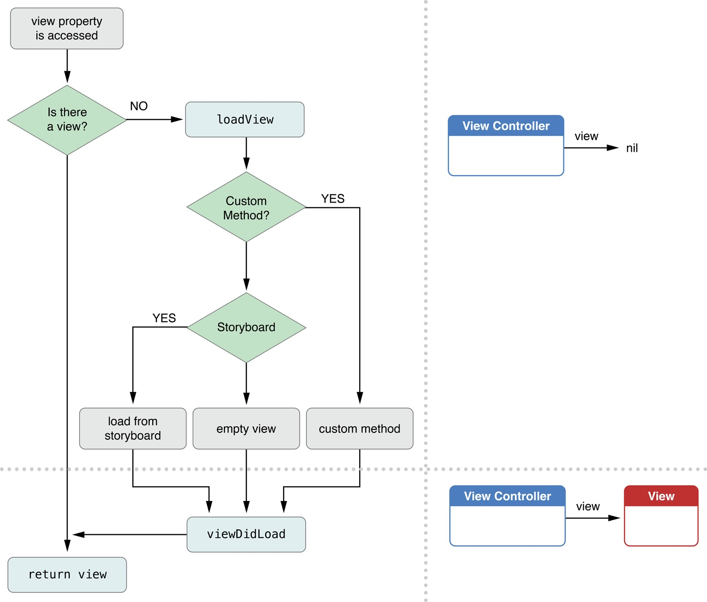
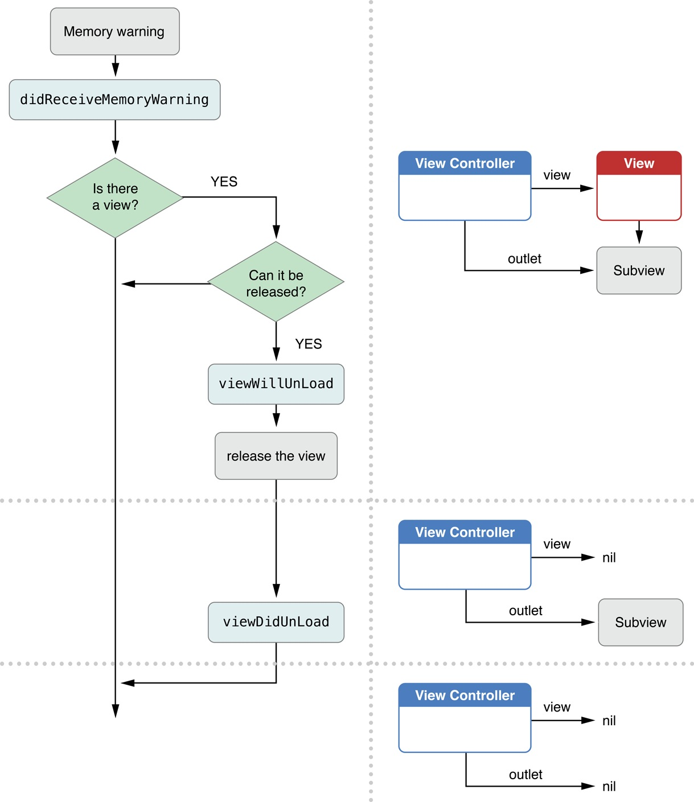
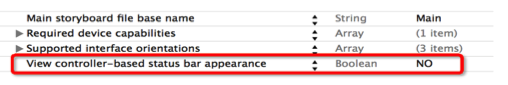

# UIViewController
- 父类是UIResponder（父类是NSObject)
- 存在UIWindow的强指针指向，所以不会销毁
- 概念：凡是继承自UIViewController的对象，都叫做控制器
- 作用：负责处理软件界面的各种事件、负责软件界面的创建和销毁
- 注意：每一个控制器（UIViewController）都会专门管理一个软件界面，内部都有个默认的UIView属性,控制器中管理的其他所有控件都是这个view的子控件（直接或者间接）
```objc
@property(null_resettable, nonatomic,strong) UIView *view;
```


##控制器的创建
1. 通过storyboard创建
- 通过xib创建控制器的view首先得要有xib。
    - xib和storyboard的区别                                   storyboard已经指定了控制器的view,不需要我们管,xib需要我们手动设置view。
- 当我们需要用storyboard或者xibm描述控制器及view的时候，使用上面两种方法，否则可以模仿上述两个过程手动创建


###通过xib创建控制器
1. 步骤：
    1. 首先创建一个Xib文件
    2. Xib文件需要拖一个View描述控制器的View
    3. 需要把Xib上的View与控制器连线，并设置Xib的File'owner为控制器
```objc
// 通过xib创建窗口的根控制器:initWithNibName
    // NibName:xib名称
    ViewController *vc = [[ViewController alloc] initWithNibName:@"VC" bundle:nil];
    self.window.rootViewController = vc;
    ```

- xib注意点:
        1> xib里面必须有一个view描述控制器的view,因为控制器的view 属性必须有值。
        2> xib需要指定描述哪一个控制器,描述UIView不需要,因为xib里面可以描述很多UIView,不能固定死,但是控制器就不一样了,一个xib就用来描述一个控制器。(设置file owner为控制器，即设置custom class）
        3> xib里面可能有很多view,需要拖线指明哪个是控制器的view

3. 假设通过Xib创建XMGViewController控制器对象
    1. 如果nibName不为空，会去创建对应的xib
    - 如果nibName为nil,首先会去查找XMGView.xib,如果有，就会去加载XMGViewController.xib
    - 如果没有找到，就会去找XMGView.xib,如果有，也会去加载
    - 都没有找到，就会生成一个空的view
    - init底层就会调用initWithNibName:bundle:(注意不会通过storyboard的方式加载）
    - Xcode7之前是先找XMGView后找XMGViewController

- xib快速创建控制器的view：
    1> 定义新的控制器的时候,勾选xib,会自动搞一个xib描述控制器的view.
    2> 会自动生成一个和控制器同名的xib,并且里面设置好了。


##控制器的view
1. 控制器View的决定权:重写LoadView>storyboard>nibName>xib

2. 控制器view的属性决定顺序是self.view——>viwDidLoad——>LoadView
3. 只要创建了控制器，无论是通过storyboard，还是xib，还是手动，都会自动创建view,如果没有指定view，创建的是一个空的view
4. 可以用isViewLoaded方法判断一个UIViewController的view是否已经被加载

- 控制器的view的懒加载
```objc
-(UIView *)view
{
    if (_view == nil) {
        [self loadView];
        [self viewDidLoad];
    }
//以后打印控制器的View真实尺寸，一般不再viewDidLoad去打印，因为不准确(还在加载数据），在viewDidAppear中打印
    return _view;
}
```
- loadView与重写loadView
    1. 第一次加载控制器的view时才会加载
    - 使用场景：自定义控制器的View就调用这个方法，例如：控制器的View想展示一张图片,或者创建UIWebView等；
    - 注意：一旦重写了loadView，就不要调用[super loadView],否则会重复view
```objc
 - (void)loadView
{
    // 如果当前控制器是窗口的根控制器，它的view可以不设置尺寸。
   UIImageView *vcView = [[UIImageView alloc]initWithImage:[UIImage imageNamed:@"1"]];
    self.view = vcView;}
    ```

- 控制器view的透明度

```objc
//alloc init创建空View,默认几乎透明（几乎透明:alpha > 0.01)
    ViewController *vc = [[ViewController alloc] init];
    vc.view.backgroundColor = [UIColor clearColor];//空view默认的颜色
    //vc.view.backgroundColor = [UIColor whiteColor];
    // 如果一个View完全透明，可以直接点击后面的东西，可以完全穿透。（完全透明：alpha <= 0.01）;另外要注意颜色与透明度无关
    vc.view.alpha = 0.02;
    ```


### 控制器的生命周期方法

1. 生命周期方法：即控制器的view什么时候创建,什么时候销毁，只要以view开头一般都是控制器view的生命周期


2. 具体的生命周期方法：（布局控件方法调用频繁，view显示与消失前都会调用）

```objc
// 控制器的view加载完成时调用
- (void)viewDidLoad {
    [super viewDidLoad];
}

// 控制器的view即将显示时调用
- (void)viewWillAppear:(BOOL)animated
{
    [super viewWillAppear:animated];
}

// 控制器的view完全显示时调用
// 一般用来调试控制器view的真实尺寸
- (void)viewDidAppear:(BOOL)animated
{
    [super viewDidAppear:animated];
}

//  控制器的view即将消失时调用
- (void)viewWillDisappear:(BOOL)animated
{
    [super viewWillDisappear:animated];
}

// 控制器的view完全消失的时候调用
- (void)viewDidDisappear:(BOOL)animated
{
    [super viewDidDisappear:animated];
}

// 控制器的view即将布局子控件的时候调用
- (void)viewWillLayoutSubviews
{
    [super viewWillLayoutSubviews];
}

// 控制器的view布局子控件的完成时候调用
- (void)viewDidLayoutSubviews
{
    [super viewDidLayoutSubviews];
}

// ARC中必须要了解
// viewDidLoad -> viewWillAppear -> viewWillLayoutSubviews -> viewDidLayoutSubviews ->  viewDidAppear -> viewWillDisappear -> viewWillLayoutSubviews -> viewDidLayoutSubviews -> viewDidDisappear    //可以看出布局控件方法调用频繁


// 非ARC
// Unload:卸载,当前view销毁
//- (void)viewWillUnload
//{
//}

// 当前view卸载完成,完全销毁的时候调用
- (void)viewDidUnload
{
    self.datas = nil;
}

//  MRC中内存机制解释
//- (void)setDatas:(NSArray *)datas
//{
//    if (datas != _datas) {
//        [_datas release];
//        _datas = [datas retain];
//    }
//}
```

- didReceiveMemoryWarning,当控制器接收内存警告的时候调用
    - 内存警告传递过程:手机内存不足产生事件->通知应用程序->调用应用程序代理方法->把事件传递给窗口->窗口传给控制器->调用控制器内存警告的方法。
    

- 当控制器接收内容警告,会销毁没有显示的控制器的view。

- 调用viewWillUnload,viewDidUnload,销毁控制器的view

- viewDidUnload里面一般清空显示在view里面的数据,演示非arc开发
    1. 为什么要清空显示view的数据:展示数据的view都不存在了,这些数据也就没有用处了,因为数据主要是用来展示在view上
    - 建议使用nil,清空数据,在非arc和arc都通用。arc是不能使用release,而且非arc,self.datas = nil;做的事情更多。

- didReceiveMemoryWarning会导致viewDidLoad重新调用。
    - 当收到内存警告,导航控制器的子控制器的view有可能被干掉,他如果没有显示的话,当下次使用这个控制器的时候就会调用。


##常用方法
1. 隐藏状态栏（IOS7以后）

```objc
//状态栏的可见性
- (BOOL)prefersStatusBarHidden;
// 直接让控制器隐藏状态栏
self.prefersStatusBarHidden = YES;```
