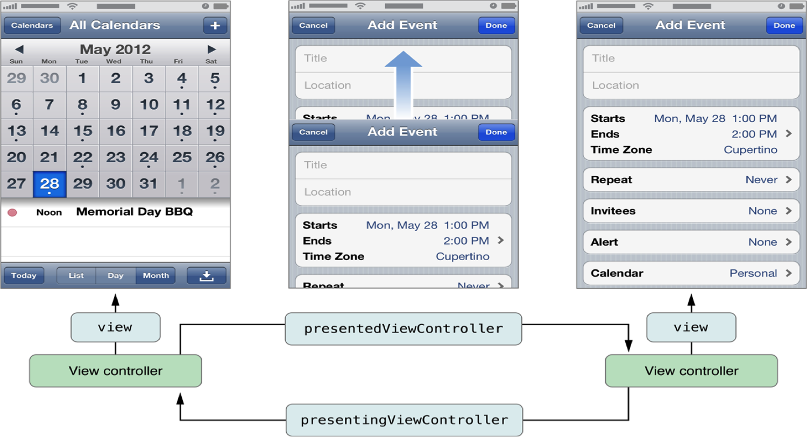

###多控制器
- 一个iOS的app很少只由一个控制器组成,除非这个app极其简单，目前苹果已经拒绝单一控制器写的app,原因是：对用户无价值

- 当app中有多个控制器的时候,我们就需要对这些控制器进行管理，思路是用1个控制器去管理其他多个控制器，成为控制器的控制器，称其为父控制器

- 为了便于管理控制器，iOS提供了2个比较特殊的控制器
    1. UINavigationController

    - UITabBarController


# UINavigationController
1. 父类是UIViewController
2. 导航控制器内部结构(导航条,导航控制器的view,存放导航控制器子控制器的view)
- 导航控制器的导航条高度是44，宽度与屏幕同齐；背景高64，宽度与屏幕同齐
- 导航控制器必须要有一个根控制器
- 导航控制器的子控制器可以直接拿到导航控制器


## 导航控制器的创建
```objc
    // 1.创建窗口
    self.window = [[UIWindow alloc] initWithFrame:[UIScreen mainScreen].bounds];

    // 2.设置窗口的根控制器

    // 创建导航控制器的根控制器
    ViewController *vc = [[ViewController alloc] init];

    // 导航控制器需要根控制器
    // 导航控制器会把根控制器作为它的子控制器
    UINavigationController *nav = [[UINavigationController alloc] initWithRootViewController:vc];

    // initWithRootViewController:底层其实就是调用push方法,把根控制器作为导航控制器的子控制器
    // 导航控制器会把子控制器的view添加到导航控制器专门存放子控制器的view上

    // 添加子控制器
//    [nav pushViewController:vc animated:YES];

    self.window.rootViewController = nav;

    // 3.显示窗口
    [self.window makeKeyAndVisible];

    return YES;
    ```


## 导航控制器的子控制器
1. 子控制器类型
```objc
    //获取栈顶控制器
    - topViewController

    //模型控制器或栈顶控制器
    - visibleViewController

    //压入栈的控制器（导航控制器的子控制器）区别？？？
    @property(nonatomic,copy) NSArray *viewControllers;
@property(nonatomic,readonly) NSArray *childViewControllers;

    //栈底控制器，pop不会被销毁,只是移除父视图
    - rootViewController

    ```
- 子控制器管理原理
    导航控制器是通过栈管理子控制器,栈是先进后出

- 导航控制器的入栈操作
    1. 怎么添加导航控制器的子控制器,push,或者一创建的时候就给一个 根控制器,默认第一个子控制器叫根控制器。
    - push把控制器压入栈,然后创建控制器的view,把控制器的view在 添加到导航控制器上
    - 怎么管理很多子控制器?push很多控制器就OK了,不要一下子push很 多子控制器,跳转控制器的权利应该交给用户,由用户决定进入那个界面。
    - 通常开发中是给某个控制器添加导航功能,是点击某个控制器中的 控件,导航到另外一个控制器
    - 因此一开始只需要显示导航控制器的根控制器就好,具体需不需要 导航,由用户决定,如果需要导航,就点击跟控制器的按钮。
    - 导航控制器的作用:用来做导航功能,一个控制器如果想拥有导航 功能,就包装成导航控制器。

```objc
//push方法能将某个控制器压入栈
- (void)pushViewController:(UIViewController *)viewController animated:(BOOL)animated;
```

- 导航控制器的出栈操作
    1. 自动出栈点击back返回,移除栈顶控制器,移除的控制器会被销毁
    - 主动出栈：通过pop手动出栈
        1. 主动出栈,要求出栈的控制器必须是栈里面的控制器,不能自己创建 一个控制器出栈,会报出栈的控制器不存在的错误,这时候可以用viewControllers或者childViewControllers拿到根控制器。
        - pop控制器,不会马上销毁栈顶控制器,而是告诉导航控制器需要把 栈顶控制器出栈,等到恰当的时间就会把栈顶控制器出栈,并且销毁。

```objc
//pop方法可以移除控制器
//将栈顶的控制器移除
- (UIViewController *)popViewControllerAnimated:(BOOL)animated;
//回到指定的子控制器
- (NSArray *)popToViewController:(UIViewController *)viewController animated:(BOOL)animated;
//回到根控制器（栈底控制器）
- (NSArray *)popToRootViewControllerAnimated:(BOOL)animated;
```


### 导航条
1. 一个导航控制器只有一个导航条,子控制器共用一个导航条。

- 导航条的内容由栈顶控制器的navigationItem决定,因此导航控制器必须要有一个根控制器,因为它本身不具备完整的显示功能,连自身的导航条也不能决定。

- 设置栈顶控制器的导航条标题（内容）,直接拿到navigationItem设置title.

- 设置navigationItem的titleView,控件位置由系统决定,只能设置尺寸。

- 设置导航条左右两边按钮,按钮必须是UIBarButtonItem,通过设置leftBarButtonItem, rightBarButtonItem,rightBarButtonItems

- 导航条上的返回按钮由上一个控制器决定。
    1. 如果上一个控制器没有设置标题,默认back
    - 如果上一个控制器设置标题,并且没有超过12个字符,默认返回标题和上一个控制器一致,如果超过12个字符,就会变成back。
    -  可以主动直接设置下一个界面的返回按钮,设置上一个控制器的backBarButtonItem属性


###如何修改导航栏的内容
- 导航栏的内容由栈顶控制器的navigationItem属性决定

```objc
//左上角的返回按钮
@property(nonatomic,retain) UIBarButtonItem *backBarButtonItem;

//中间的标题视图
@property(nonatomic,retain) UIView          *titleView;

//中间的标题文字
@property(nonatomic,copy)   NSString        *title;

//左上角的视图
@property(nonatomic,retain) UIBarButtonItem *leftBarButtonItem;

//右上角的视图
@property(nonatomic,retain) UIBarButtonItem *rightBarButtonItem;
```


### ios6和ios7导航控制器的区别？？？
```objc

 // 左边的内容
    UIBarButtonItem *item = [[UIBarButtonItem alloc] initWithTitle:@"返回" style:UIBarButtonItemStyleDone target:self action:@selector(back)];

// 在iOS7之后,默认会导航条上按钮的图片渲染成蓝色
    // 获取图片
    UIImage *image = [UIImage imageNamed:@"navigationbar_friendsearch"];
    // 告诉这个图片不要渲染
    // 返回一个没有渲染的图片给你
    image = [image imageWithRenderingMode:UIImageRenderingModeAlwaysOriginal];

    UIBarButtonItem *item1 = [[UIBarButtonItem alloc] initWithImage:image style:UIBarButtonItemStyleDone target:nil action:nil];


    // 显示多张图片,不同状态,用按钮
    UIButton *btn = [UIButton buttonWithType:UIButtonTypeCustom];
    [btn setImage:[UIImage imageNamed:@"navigationbar_friendsearch"] forState:UIControlStateNormal];

    [btn setImage:[UIImage imageNamed:@"navigationbar_friendsearch_highlighted"] forState:UIControlStateHighlighted];

    // 按钮自适应,根据图片计算尺寸
    [btn sizeToFit];


    UIBarButtonItem *item2 = [[UIBarButtonItem alloc] initWithCustomView:btn];

//    self.navigationItem.leftBarButtonItem = item;

    // 右边内容
    self.navigationItem.rightBarButtonItems = @[item,item1,item2];


    // 如果以后看到系统的类带有Item,就是苹果提供的模型
    // UINavigationItem:设置导航条内容 模型
    // UIBarButtonItem:设置导航条上按钮的内容 模型
```


## 导航控制器-利用storyboard创建
    1. 程序一启动,就加载导航控制器,设置storyboard箭头指向导航控制 器
    - 设置导航控制器的根控制器为UIViewController
    - 设置导航条的内容,还有下一个控制器的返回按钮
    - 利用storyboard做跳转,选中按钮拖线
    - 利用按钮,回到上一个控制器,不能回拖,会新创建一个控制器, 只能通过代码。


##控制器的数据传递
- 控制器之间的数据传递主要有2种情况:顺传和逆传
    1. 顺传
        1. 控制器的跳转方向  : A -> C
        - 数据的传递方向     : A -> C
        - 数据的传递方式     :
            - 在A的`prepareForSegue:sender:`方法中根据segue参数取得destinationViewController, 也就是控制器C,直接给控制器C传递数据
(要在C的viewDidLoad方法中取得数据,来赋值给界面上的UI控件)

    - 逆传
        1. 控制器的跳转方向  : A -> C
        2. 数据的传递方向    : C <- A
        3. 数据的传递方式    : 让A成为C的代理, 在C中调用A的代理方法,通过代理方法的参数传递数据给A


#导航控制器
1. 导航控制器永远显示的是栈顶控制器的view

2. 导航控制器中做界面之间的跳转必须拿到导航控制器

3. 调用pop方法并不会马上销毁当前控制器

4. popToViewController使用注意点,传入进去的控制器必须是导航控制器栈里面的控制器

5. 导航条的内容由栈顶控制器决定,一个导航控制器只有一个导航条,因此只能由一个控制器决定,谁先显示在最外面,谁就是栈顶控制器.

6. 在iOS7之后,默认会把导航条上的按钮的图片渲染成蓝色.

7. 导航条上的子控件位置不需要我们管理,只需要管理尺寸

8. UINavigationItem:是一个模型,决定导航条的内容(左边内容,中间,右边内容)

9. UIBarButtonItem:是一个模型,决定导航条上按钮的内容

10. 以后只要看到item,通常都是苹果提供的模型,只要改模型就能修改苹果的某些控件.


###Modal
1. 除了push之外，还有另外一种控制器的切换方式，那就是Modal

- 任何控制器都能通过Modal的形式展示出来

- Modal的默认效果：新控制器从屏幕的最底部往上钻，直到盖住之前的控制器为止


```objc
//以Modal的形式展示控制器
- (void)presentViewController:(UIViewController *)viewControllerToPresent animated: (BOOL)flag completion:(void (^)(void))completion

//关闭当初Modal出来的控制器
- (void)dismissViewControllerAnimated: (BOOL)flag completion: (void (^)(void))completion;
```


###在vc.m中
- (IBAction)modal:(id)sender {
    // ViewController modal出 OneViewController
    // OneViewController 自己dismiss
    OneViewController *oneVc = [[OneViewController alloc] init];

    // 谁modal谁就强引用modal出来的控制器
    //  oneVc被ViewController的presentedViewController强引用


    // 如果一个控制器的view显示到屏幕上,这个控制器一定不能被销毁.

    // 切换到第一个控制器
    [self presentViewController:oneVc animated:YES completion:^{
        // 打印窗口的根控制器
//        UIViewController *rootVc = [UIApplication sharedApplication].keyWindow.rootViewController;
        NSLog(@"%@",self.presentedViewController);
    }];

    // 自己需要Modal出OneViewController的view
    // 1.把OneViewController的view添加到窗口上,移除之前窗口上的view

//    UIWindow *keyWindow = [UIApplication sharedApplication].keyWindow;
//    [keyWindow addSubview:oneVc.view];
//    // 2.慢慢往上钻的动画
//    // 先设置形变
//    oneVc.view.transform = CGAffineTransformMakeTranslation(0, keyWindow.bounds.size.height);
//
//    [UIView animateWithDuration:0.5 animations:^{
//        // 还原形变
//        oneVc.view.transform = CGAffineTransformIdentity;
//    } completion:^(BOOL finished) {
//
//        [self.view removeFromSuperview];
//    }];
}


##在oneVc.m中
- (IBAction)modal:(id)sender {

    TwoViewController *twoVc = [[TwoViewController alloc] init];

    [self presentViewController:twoVc animated:YES completion:nil];
}

// 点击dismiss退下当前modal出来的控制器
- (IBAction)dismiss:(id)sender {

    // modal出谁,谁就能dismiss

    // 谁Modal,谁也可以dismiss
    [self dismissViewControllerAnimated:YES completion:nil];
    // dismissViewControllerAnimated永远是退下最后modal出来的控制器
}


在twoVc.m中
- (IBAction)dismiss:(id)sender {
    [self dismissViewControllerAnimated:YES completion:nil];
}
