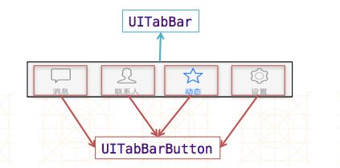
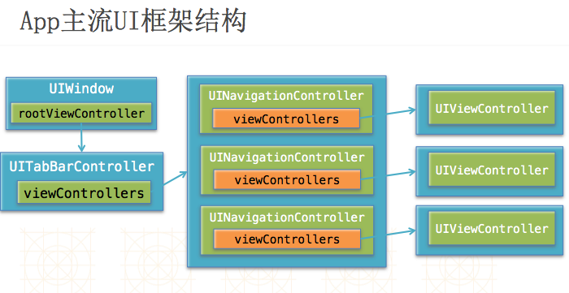

# UITabBarController
- 父类是UIViewController
- 默认显示第0个控制器的view

## UITabBarController的使用步骤
- 初始化UITabBarController
- 设置UIWindow的rootViewController为UITabBarController
- 根据具体情况，通过addChildViewController方法添加对应个数的子控制器


##UITabBarController添加控制器的方式有2种
```objc
- 添加单个子控制器
- (void)addChildViewController:(UIViewController *)childController;

- 设置子控制器数组
@property(nonatomic,copy) NSArray *viewControllers;
```

##UITabBar
- 如果UITabBarController有N个子控制器，那么UITabBar内部就会有N个UITabBarButton作为子控件

- 如果UITabBarController有4个子控制器，那么UITabBar的结构大致如下图所示


- UITabBarButton里面显示什么内容，由对应子控制器的tabBarItem属性决定


##UITabBarItem
- UITabBarItem有以下属性影响着UITabBarButton的内容

```objc
标题文字
@property(nonatomic,copy) NSString *title;

图标
@property(nonatomic,retain) UIImage *image;

选中时的图标
//IOS7之后，默认按钮被选中，则图片会被渲染成蓝色；以前的不会
@property(nonatomic,retain) UIImage *selectedImage;

提醒数字
//若有图标，则提醒数字在图标右方，否则在左方；数字最多建议为99+
@property(nonatomic,copy) NSString *badgeValue;
```

##App主流UI框架结构

- 主流框架是以UITabBarController为窗口的根控制器，子控制器都是UINavigationController，导航控制器再接vc用于界面显示与事件处理，这样可以实现底部导航栏可以显示所有主要的界面，每个子界面之间可以通过导航控制器跳转

- 非主流框架是以UINavigationController为窗口的根控制器，再接一个子控制器UITabBarController，然后连接多个子控制器vc用于界面显示与事件处理，这样的话主流框架跳转优势只能两者得一


