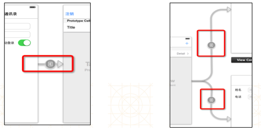
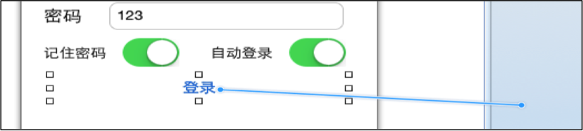
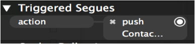
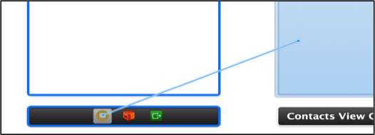
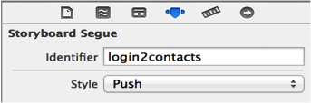

# UIStoryboardSegue
- 父类是NSObject
- Storyboard上每一根用来界面跳转的线，都是一个UIStoryboardSegue对象（简称Segue）


### UIStoryboardSegue所有属性
```objc
//唯一标识
@property (nonatomic, readonly) NSString *identifier;
//来源控制器
@property (nonatomic, readonly) id sourceViewController;
//目标控制器
@property (nonatomic, readonly) id destinationViewController;
```

### UIStoryboardSegue所有方法
```objc
- (void)perform;
```


### segue类型：
- 根据Segue的执行（跳转）时刻，Segue可以分为2大类型
    - 自动型：点击某个控件后（比如按钮），自动执行Segue，自动完成界面跳转

    - 手动型：需要通过写代码手动执行Segue，才能完成界面跳转


###自动型


- 点击“登录”按钮后，就会自动跳转到右边的控制器
- 按住Control键，直接从控件拖线到目标控制器
- 如果点击某个控件后，不需要做任何判断，一定要跳转到下一个界面，建议使用“自动型Segue”

###手动型
- 按住Control键，从来源控制器拖线到目标控制器


- 手动型的Segue需要设置一个标识（如右图）


- 在恰当的时刻，使用perform方法执行对应的Segue
```objc
[self performSegueWithIdentifier:@"login2contacts" sender:nil];
// Segue必须由来源控制器来执行，也就是说，这个perform方法必须由来源控制器来调用
```
- 如果点击某个控件后，需要做一些判断，也就是说：满足一定条件后才跳转到下一个界面，建议使用“手动型Segue”

##performSegueWithIdentifier
1. 利用performSegueWithIdentifier:方法可以执行某个Segue，完成界面跳转

- 完整执行过程

```objc
[self performSegueWithIdentifier:@“login2contacts” sender:nil];
// 这个self是来源控制器

//生成UIStoryboardSegue对象，并设置属性
根据identifier去storyboard中找到对应的线，新建UIStoryboardSegue对象
设置Segue对象的sourceViewController（来源控制器）
新建并且设置Segue对象的destinationViewController（目标控制器）


//调用sourceViewController的下面方法，做一些跳转前的准备工作并且传入创建好的Segue对象
- (void)prepareForSegue:(UIStoryboardSegue *)segue sender:(id)sender;
// 这个sender是当初performSegueWithIdentifier:sender:中传入的sender

//调用Segue对象的- (void)perform;
//方法开始执行界面跳转操作
1. 如果segue的style是push
取得sourceViewController所在的UINavigationController
调用UINavigationController的push方法将destinationViewController压入栈中，完成跳转

2. 如果segue的style是modal
调用sourceViewController的presentViewController方法将destinationViewController展示出来


###sender参数传递
[self performSegueWithIdentifier:@“login2contacts” sender:@“jack”];

- (void)prepareForSegue:(UIStoryboardSegue *)segue sender:(id)sender;
```
