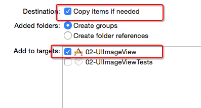
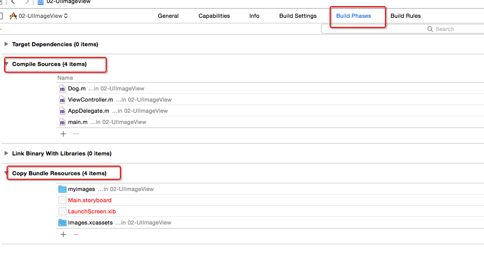

# Xcode
## 项目的常见属性
- Product Name
    - 产品名称
    - 项目名称
    - 软件名称
- Organization Name
    - 公司名称
- Organization Identifier
    - 公司的唯一标识
    - 一般用网站域名的反写形式
- Bundle Identifier
    - 软件的唯一标识
    - 默认 == Organization Identifier + Product Name

##项目中的常见文件
1. Texts文件夹:单元测试
2. Frameworks:依赖的框架
3. Info.plist:项目配置文件
    - 为什么要搞个配置文件,保存应用的信息,软件名称等等,相当于身份证。程序加载首先加载配置文件,读取软件名称等信息
4. Info.plist对应xcode的project的图形界面,改图形界面的东西,就会改变 Info.plist，比如方向等
5. pch文件:也是一个头文件,能被项目中的其他所有源文件共享和访问，在项目中设置预处理该文件，这样就不用以一个文件复制粘贴，pch可存放
        1> 放一些全局的宏
        2> 导入一些全局都需要的头文件,一般开发中放工具类的头文件, 或者分类头文件等。
        3> 管理日志输出
            - 为什么要管理日志输出,因为日志输出非常耗性能,一般发布的时候不需要日志输出,只有调试的时候才需要。
    - 5.1 通常开发中弄一个自己的日志输出,不要系统自带的NSLog
```objc
#defineCZLog(...) NSLog(__VA_ARGS__)
...表示能接收任何参数
__VA_ARGS__ 表示左边...的参数会替代到右边NSLog中。
1> 如果不想打印了,直接注释后边的 #define CZLog(...) // NSLog(__VA_ARGS__)
2> 还可以通过一个宏进行条件编译,在调试阶段,xcode会自动定 义一个DEBUG宏,利用这个宏,就能进行条件编译.
 5.3 在pch写的有关OC的东西,最好放在#ifdef__OBJC__,Xcode在每个OC文件中都定义了这个宏,也就意味着只有OC中的文件才拥有这些宏,避免项目中有C文件的时候,报错，另外#import也一样
```


## info.plist
- 该文件对工程做一些运行期的配置，非常重要，不能删除
- 旧版本Xcode创建的工程会在Supporting files文件夹下看到一个“工程名-Info.plist”的文件，新版本就叫“Info.plist”，项目中其他Plist文件不能带有“Info”这个字眼，项目中还有一个InfoPlist.strings的文件，跟Info.plist文件的本地化相关
- Bundle identifier:项目的唯一标识
- Localiztion native development region(CFBundleDevelopmentRegion)-本地化相关
- Bundle displayname(CFBundleDisplayName)-程序安装后显示的名称,限制在10－12个字符，如果超出，将被显示缩写名称
- Icon file(CFBundleIconFile)-app图标名称,一般为Icon.png
- Bundle version(CFBundleShortVersionString)-应用程序的版本号，每次往App Store上发布一个新版本时，需要增加这个版本号
- Main storyboard file base name(NSMainStoryboardFile)-主storyboard文件的名称
- Bundle identifier(CFBundleIdentifier)-项目的唯一标识，部署到真机时用到


##资源管理
- 添加外界的代码\资源到本项目中，建议的设置选项


- 查看从外界加进来的代码\资源，有没有打包到本项目



## xcode5和xcode6区别
1. xcode6没有Frameworks文件夹,xcode6内部会自动帮你导入一些常见的框架.
2. xcode6多了LaunchScreen.xib,LaunchScreen.xib设置启动界面,而且可以确定模拟器或者真机的真实尺寸,如果没有设置,默认4s的尺寸(320,480)
3. 模拟器或者真机的真实尺寸是由启动界面确定
4. bxcode6没有pch文件
